# Elitra Core - System Architecture

A cross-chain ERC-4626 vault system with LayerZero integration for multi-chain yield strategies.

## Table of Contents

1. [System Overview](#1-system-overview)
2. [Manage Security](#2-manage-security)
3. [Oracle System](#3-oracle-system)
4. [Deposit & Withdraw Queue](#4-deposit--withdraw-queue)
5. [Cross-chain Deposit Design](#5-cross-chain-deposit-design)

---

## 1. System Overview

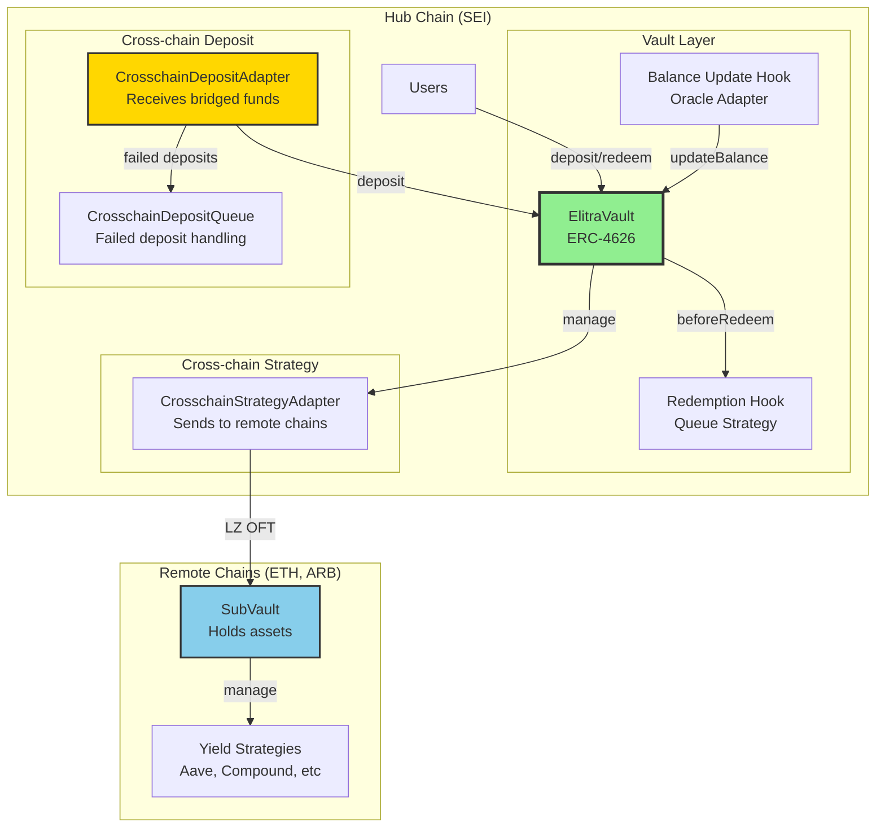

---

## 2. Manage Security

The `manage()` function allows operators to execute vault strategy operations. A **guard-per-target architecture** ensures security through fail-closed validation.

### 2.1 Security Layers

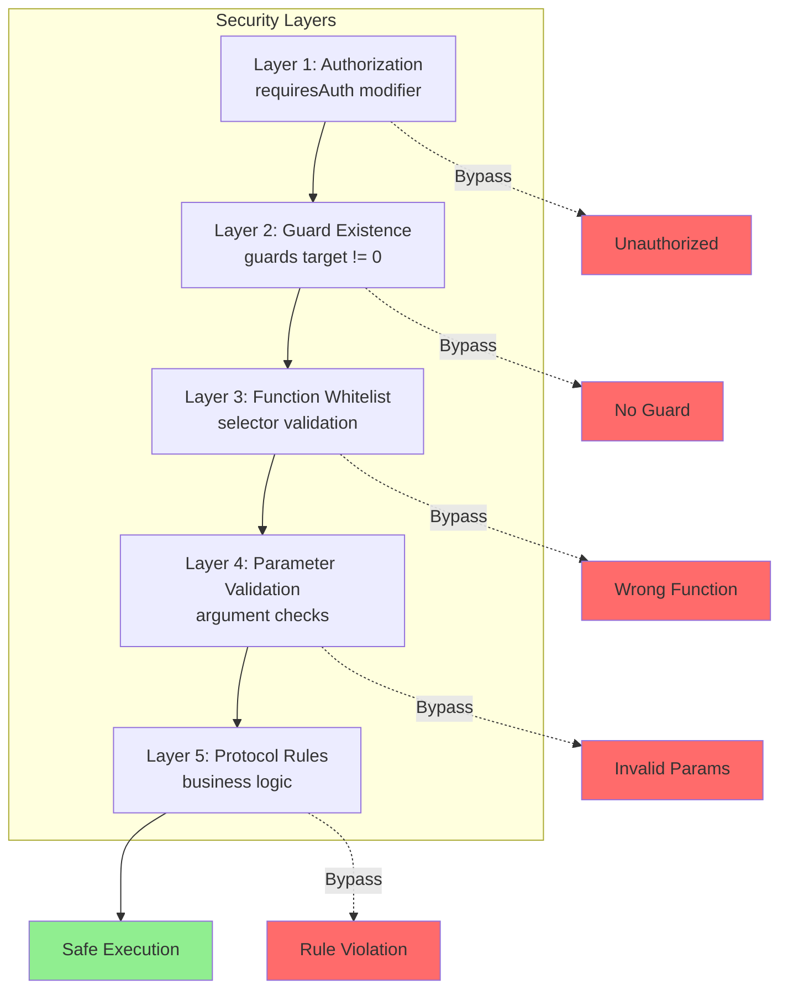

### 2.2 Guard-per-Target Architecture

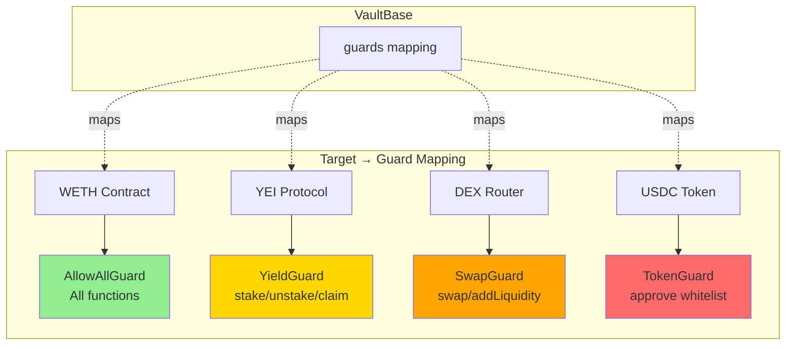

### 2.3 Execution Flow

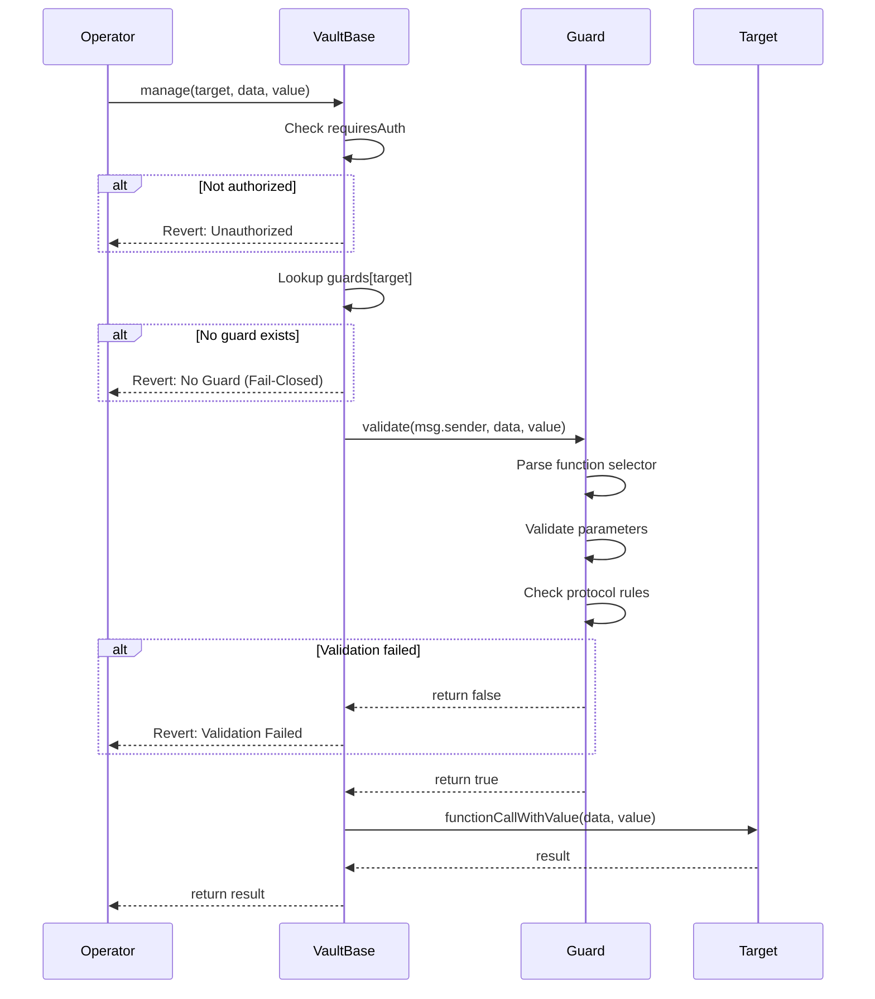

### 2.4 Guard Types

| Guard Type | Purpose | Example Rules |
|------------|---------|---------------|
| `AllowAllGuard` | Trusted contracts | All functions allowed |
| `TokenGuard` | ERC20 operations | Approve only whitelisted spenders |
| `YieldGuard` | Yield protocols | stake/unstake/claim with limits |
| `SwapGuard` | DEX operations | swap/addLiquidity with slippage checks |

---

## 3. Oracle System

The oracle system aggregates balances from external protocols and updates the vault's price per share.

### 3.1 Balance Update Flow

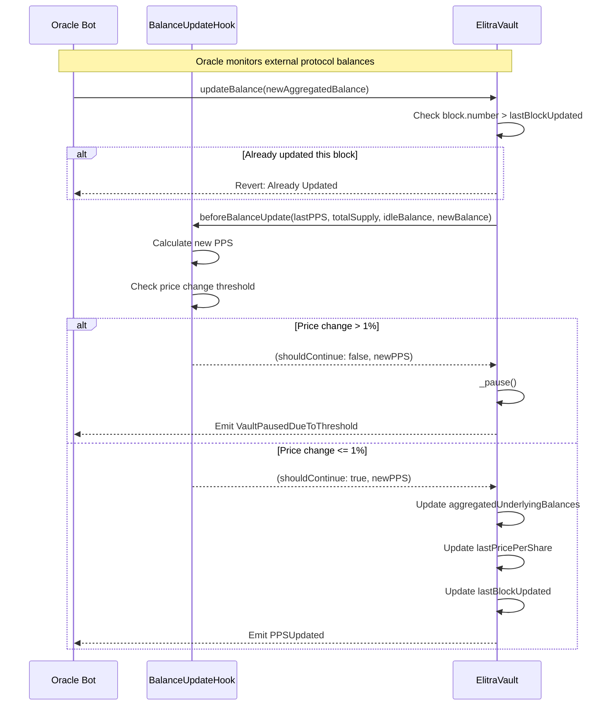

### 3.2 Price Per Share Calculation

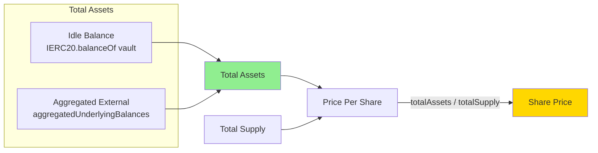

### 3.3 Auto-Pause Mechanism

The vault automatically pauses if price per share changes by more than 1% in a single update:

```
priceChange = |newPPS - lastPPS| / lastPPS

if priceChange > 1%:
    vault.pause()
    emit VaultPausedDueToThreshold
```

**Protection Against:**
- Oracle manipulation
- Sudden strategy losses
- Flash loan attacks

---

## 4. Deposit & Withdraw Queue

### 4.1 Deposit Flow

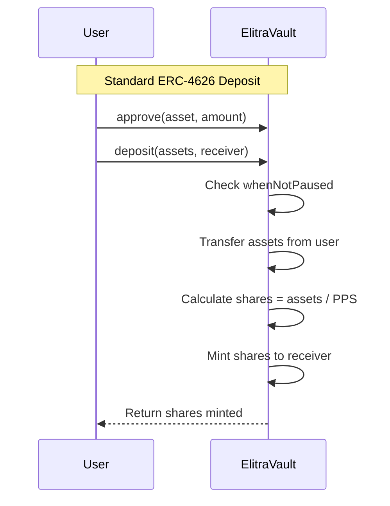

### 4.2 Redemption Flow

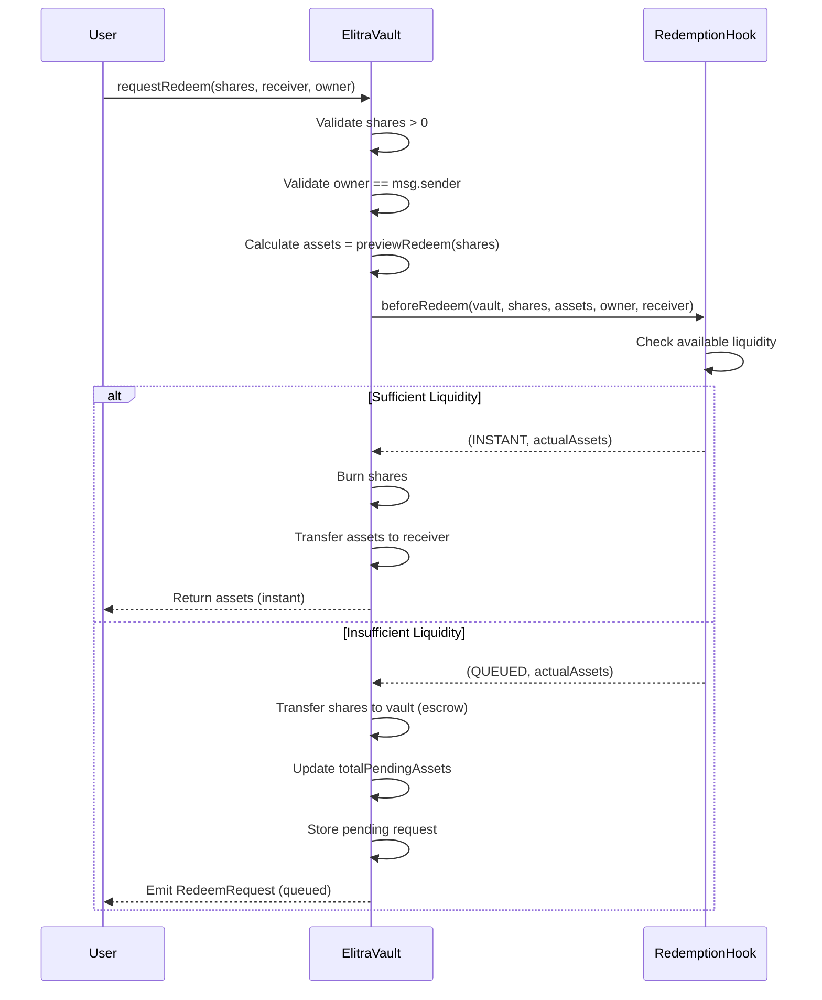

### 4.3 Queue Fulfillment

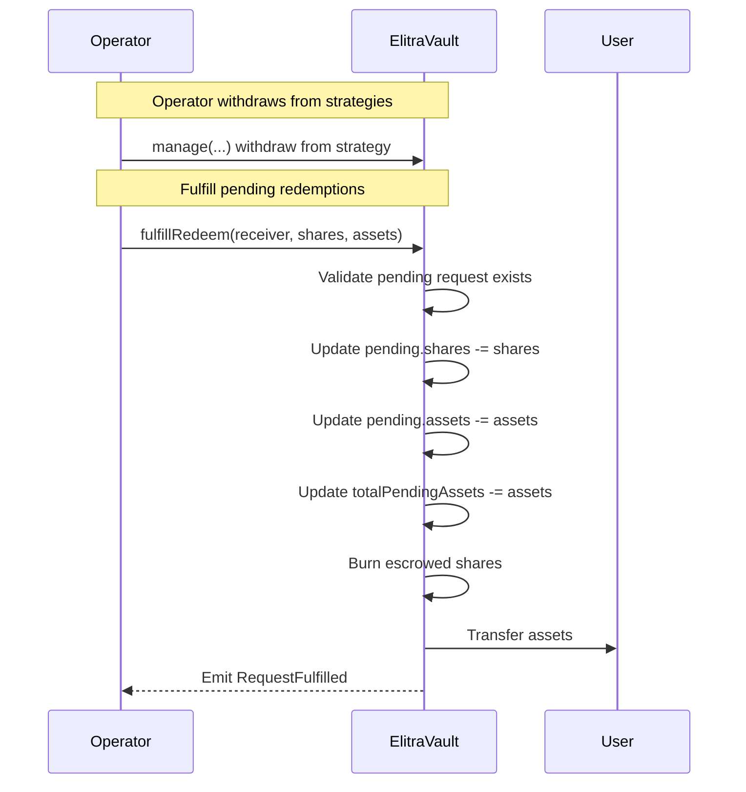

### 4.4 Redemption States

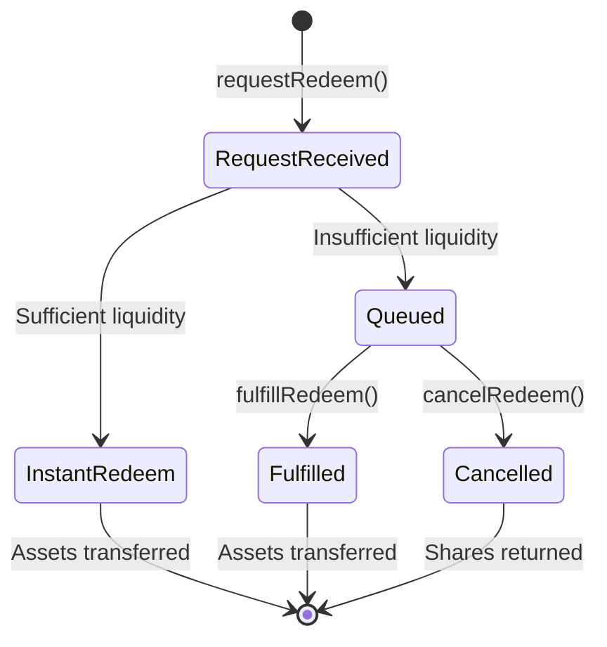

---

## 5. Cross-chain Deposit Design

### 5.1 Architecture Overview

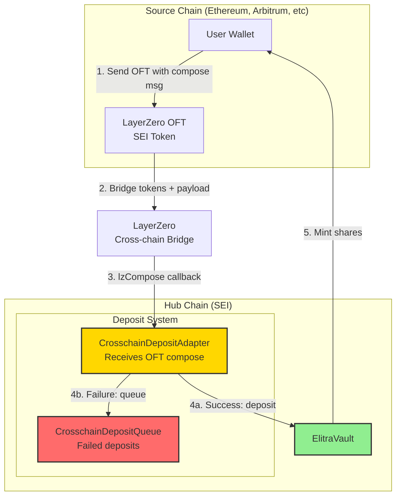

### 5.2 Compose Message Format

```solidity
// User sends OFT with compose message containing:
bytes memory composeMsg = abi.encode(
    vault,        // Target vault address
    receiver,     // Who receives shares
    minAmountOut, // Slippage protection
    zapCalls      // Optional zap operations (e.g., wrap WSEI)
);
```

### 5.3 Deposit Flow with Zapping

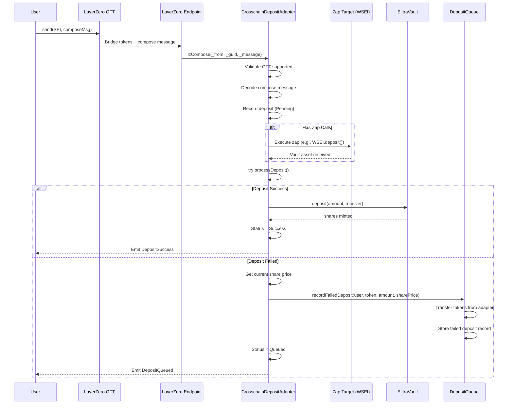

### 5.4 Failed Deposit Handling

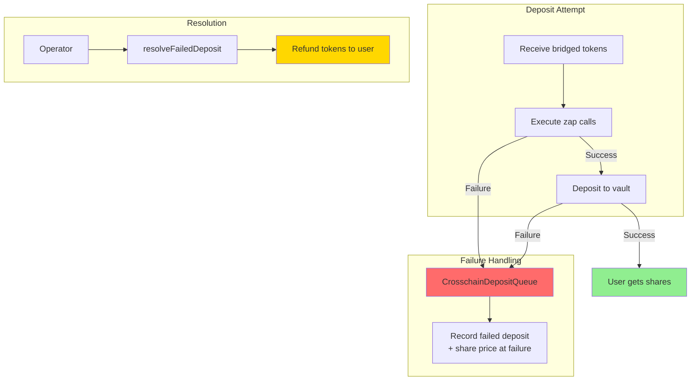

### 5.5 Queue Data Structure

```solidity
struct FailedDeposit {
    address user;           // Who should receive shares/refund
    uint32 srcEid;          // Source chain endpoint ID
    address token;          // Bridged token address
    uint256 amount;         // Amount of tokens
    address vault;          // Target vault
    bytes32 guid;           // LayerZero message GUID
    bytes failureReason;    // Why deposit failed
    uint256 timestamp;      // When failure occurred
    uint256 sharePrice;     // PPS at time of failure
    DepositStatus status;   // Failed | Resolved
}
```

### 5.6 Deployment Flow

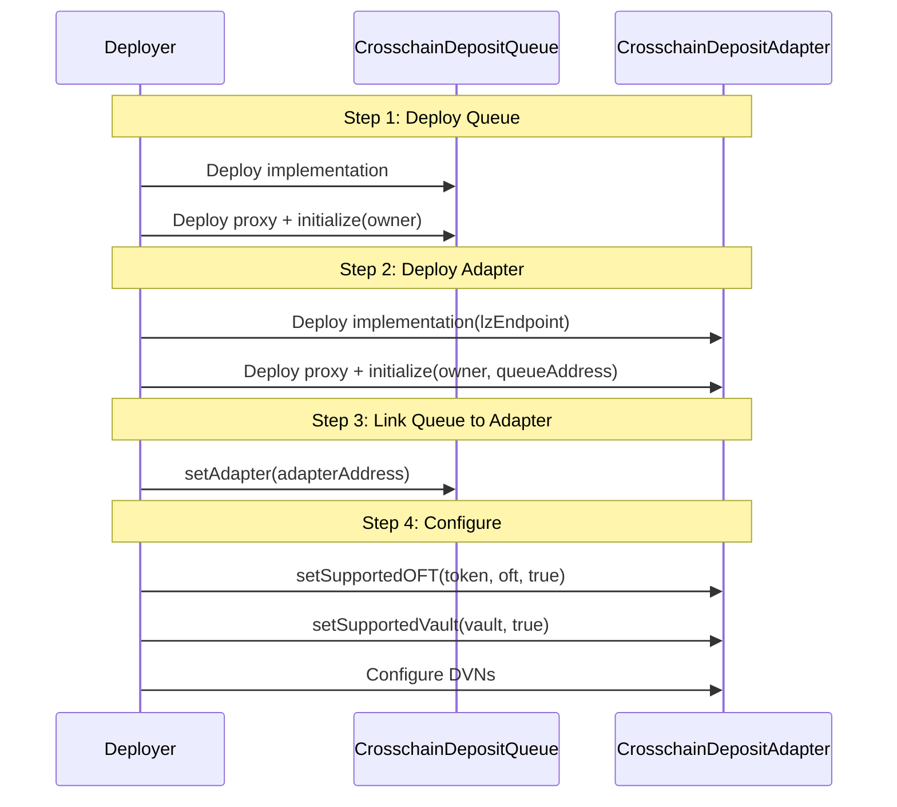

### 5.7 Security Features

| Feature | Description |
|---------|-------------|
| **OFT Whitelist** | Only approved OFTs can trigger deposits |
| **Vault Whitelist** | Only approved vaults can receive deposits |
| **Slippage Protection** | `minAmountOut` prevents front-running |
| **Failed Deposit Queue** | No fund loss on failures |
| **Share Price Snapshot** | Records PPS at failure for fair resolution |
| **Pausable** | Admin can pause all operations |
| **Reentrancy Guard** | Protected against reentrancy |

---

## Project Structure

```
elitra-core/
├── src/
│   ├── ElitraVault.sol                    # Main ERC-4626 vault
│   ├── adapters/layerzero/
│   │   ├── CrosschainDepositAdapter.sol   # Receives cross-chain deposits
│   │   ├── CrosschainDepositQueue.sol     # Handles failed deposits
│   │   └── CrosschainStrategyAdapter.sol  # Sends funds to remote chains
│   ├── vault/
│   │   ├── VaultBase.sol                  # Base with auth & guards
│   │   └── SubVault.sol                   # Remote chain vault
│   ├── guards/                            # Transaction guards
│   ├── hooks/                             # Oracle & redemption hooks
│   └── interfaces/
├── script/
│   ├── crosschain-deposit/                # Deposit system scripts
│   ├── crosschain/                        # Strategy scripts
│   └── deploy/                            # Vault deployment
├── config/                                # Chain configs
└── specs/                                 # Detailed specifications
```

## License

MIT License - see [LICENSE.md](LICENSE.md)
