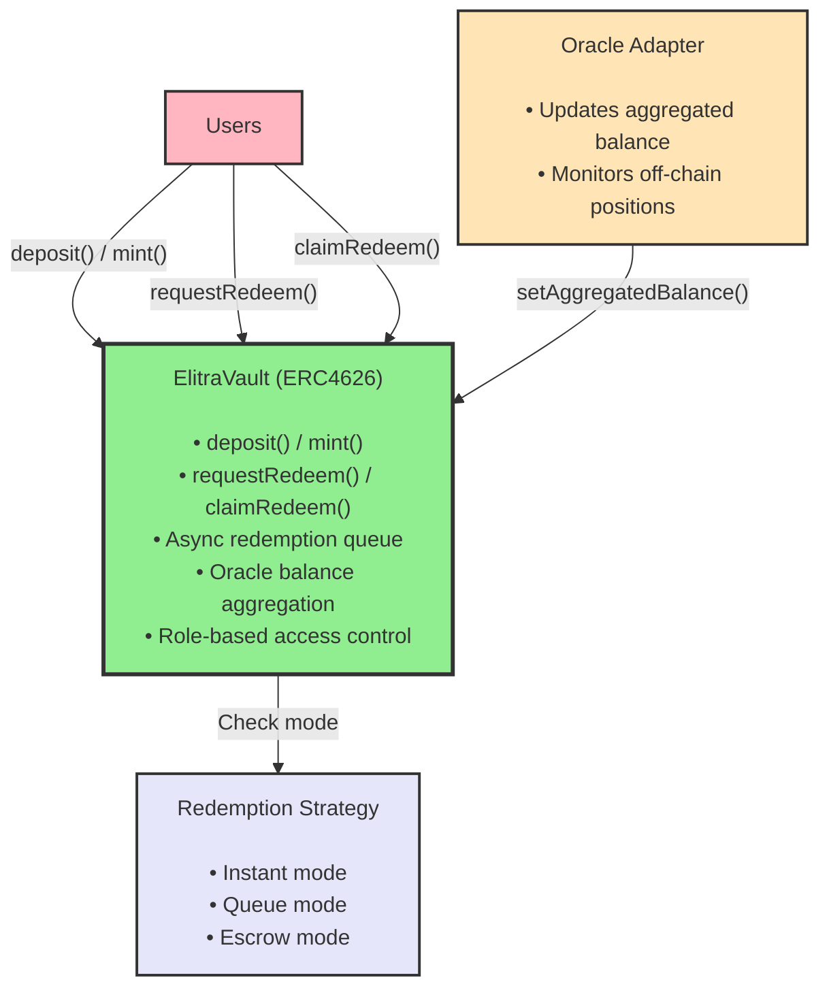
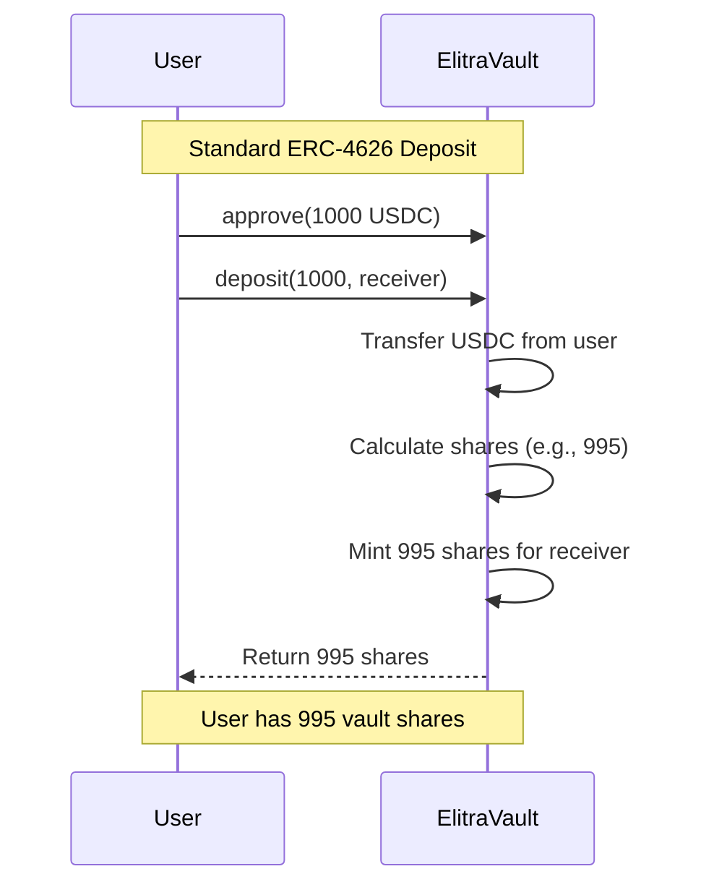
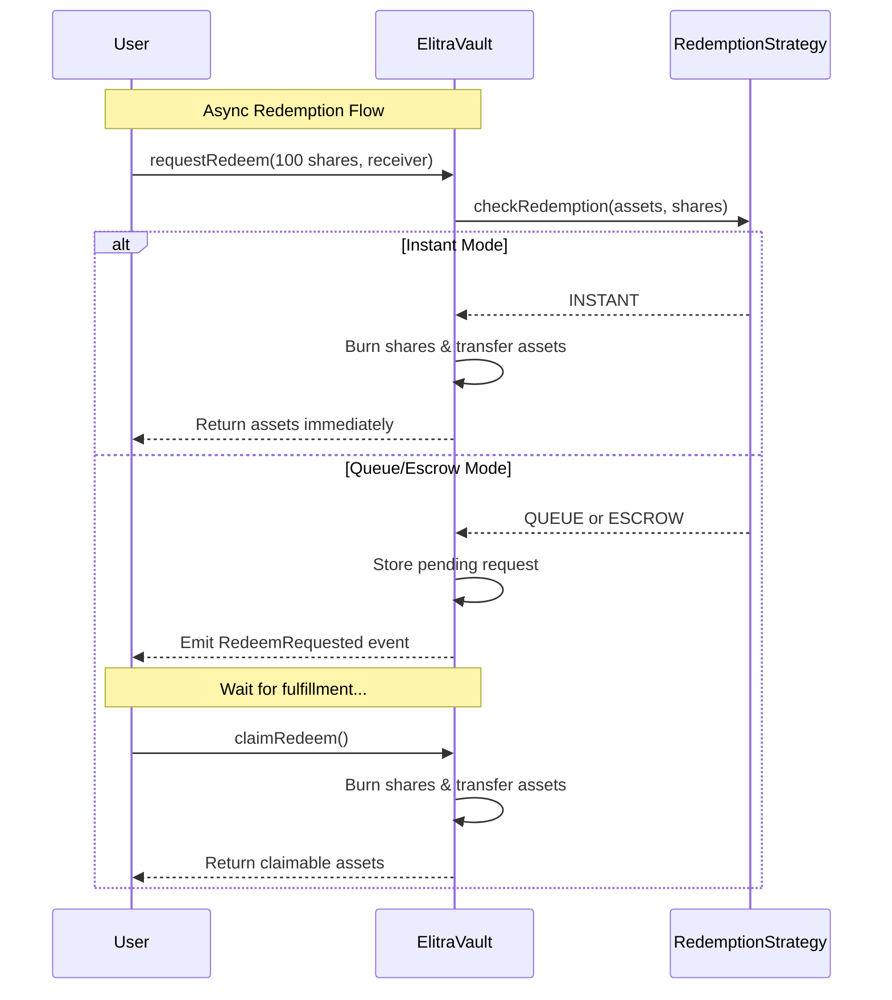

# Elitra Core - ERC-4626 Vault System

2025-11-10

## Executive Summary

Elitra Core is a **simple ERC-4626 vault system** with oracle-based balance aggregation and async redemption.

**Core Features:**

- Standard ERC-4626 vault interface
- Async redemption queue for smooth liquidity management
- Oracle-based balance aggregation with 1% auto-pause safety
- Role-based access control
- Pluggable redemption strategies

---

## Table of Contents

1. [System Architecture](#1-system-architecture)
2. [Core Vault Components](#2-core-vault-components)
3. [User Flows](#3-user-flows)
4. [Technical Specifications](#4-technical-specifications)
5. [Security Considerations](#5-security-considerations)

---

## 1. System Architecture

### 1.1 High-Level System Design



### 1.2 Deposit Flow



### 1.3 Redemption Flow



---

## 2. Core Vault Components

### 2.1 ElitraVault

**Key Features:**

- Standard ERC-4626 vault interface
- Single asset type per vault (USDC, USDe, etc.)
- Async redemption queue with pluggable strategies
- Oracle-based balance aggregation
- Auto-pause on price changes > 1%
- Role-based access control

**Key Functions:**

```solidity
// Standard ERC-4626
function deposit(uint256 assets, address receiver) returns (uint256 shares);
function mint(uint256 shares, address receiver) returns (uint256 assets);

// Async redemption
function requestRedeem(uint256 shares, address receiver, address owner) returns (uint256);
function claimRedeem() returns (uint256 assets);
function fulfillRedeem(address receiver, uint256 shares, uint256 assets);

// Oracle integration
function setAggregatedBalance(uint256 newBalance, uint256 newPPS);

// Strategy management
function manage(address target, bytes calldata data, uint256 value) returns (bytes memory);
```

### 2.2 Oracle Adapter

**Purpose:** Updates vault's aggregated balance from off-chain positions

**Key Features:**

- Monitors vault positions across strategies
- Reports total underlying balance to vault
- Triggers auto-pause if price change > 1%

### 2.3 Redemption Strategy

**Purpose:** Determines redemption mode (instant or queue)

**Modes:**

- **INSTANT:** Sufficient liquidity available, redeem immediately
- **QUEUE:** Insufficient liquidity, queue request for later fulfillment

---

## 3. User Flows

### 3.1 Deposit Flow

1. User approves vault asset (e.g., USDC) to vault
2. User calls `vault.deposit(assets, receiver)`
3. Vault transfers assets from user
4. Vault calculates and mints shares based on current price per share
5. User receives vault shares

### 3.2 Redemption Flow

#### Instant Redemption

1. User calls `vault.requestRedeem(shares, receiver, owner)`
2. Redemption strategy checks liquidity → returns INSTANT mode
3. Vault burns shares and transfers assets immediately
4. User receives assets

#### Queued Redemption

1. User calls `vault.requestRedeem(shares, receiver, owner)`
2. Redemption strategy checks liquidity → returns QUEUE mode
3. Vault stores pending redemption request
4. Emits `RedeemRequested` event
5. Operator withdraws from strategies and calls `fulfillRedeem()`
6. User calls `claimRedeem()` to receive assets

### 3.3 Strategy Management

Operators can deploy vault assets to yield strategies using the `manage()` function:

```solidity
vault.manage(
    target: StrategyContract,
    data: abi.encodeCall(Strategy.deposit, (assets)),
    value: 0
)
```

**Access Control:** Only authorized operators can call `manage()`. The vault checks permissions via the Authority contract.

**Oracle Updates:** After deploying assets, the oracle monitors strategy balances and reports the aggregated total back to the vault via `setAggregatedBalance()`.

**Share Price Formula:**
```
sharePrice = (idleAssets + aggregatedUnderlyingBalances) / totalShares
```

---

## 4. Technical Specifications

### 4.1 Auto-Pause Mechanism

The vault automatically pauses deposits/withdrawals if the price per share changes by more than 1% in a single oracle update:

```solidity
uint256 priceChange = newPPS > lastPPS
    ? (newPPS - lastPPS) * DENOMINATOR / lastPPS
    : (lastPPS - newPPS) * DENOMINATOR / lastPPS;

if (priceChange > MAX_PERCENTAGE) {
    _pause();
}
```

This protects users from oracle manipulation or sudden strategy losses.

### 4.2 Security Features

- Role-based access control for sensitive operations
- Pausable deposits/mints/redemptions
- One oracle update per block maximum
- Async redemption queue prevents bank runs
- ERC-4626 standard compliance for composability

---

## 5. Security Considerations

- **Oracle Security:** The oracle adapter is a trusted role. Ensure proper access control and monitoring.
- **Strategy Risk:** Assets deployed to strategies carry smart contract risk. Only use audited strategies.
- **Redemption Queue:** Users should understand that redemptions may not be instant during low liquidity periods.
- **Auto-Pause:** While protective, false positives could temporarily lock user funds. Monitor oracle reliability.
- **Access Control:** Carefully configure the Authority contract to prevent unauthorized `manage()` calls.
