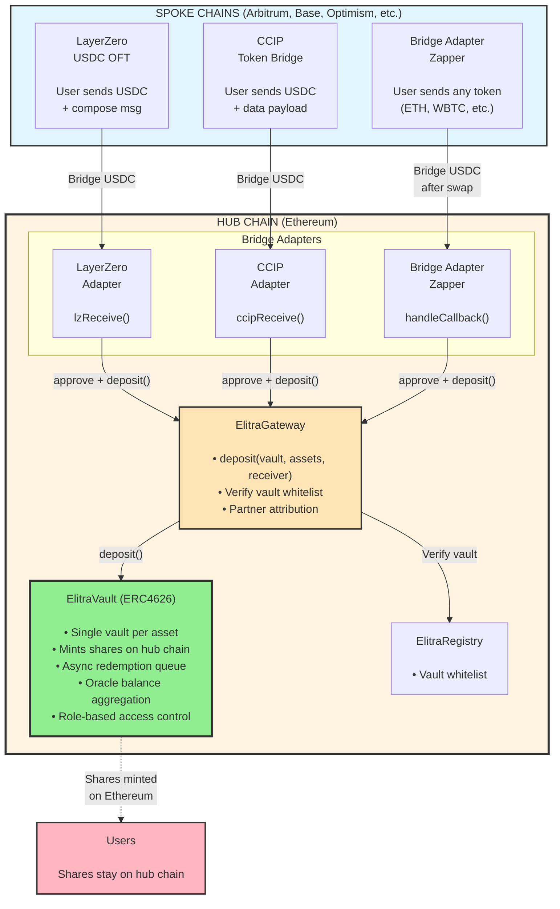
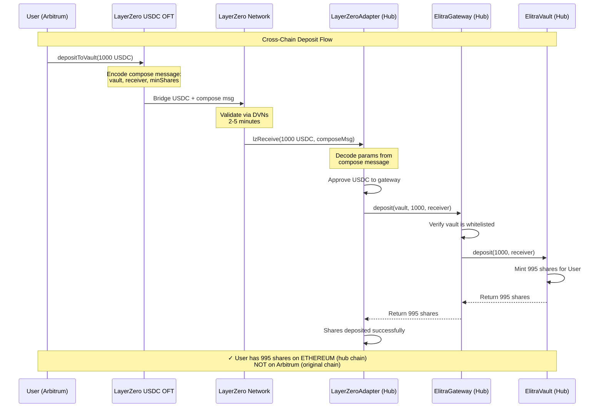
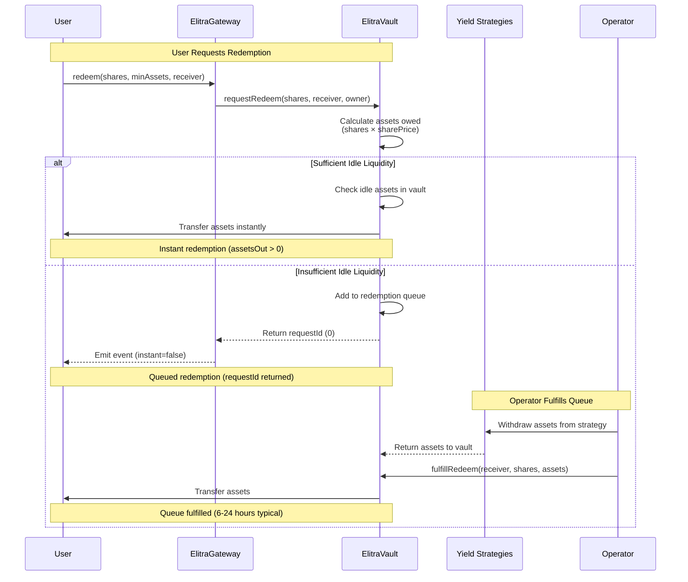
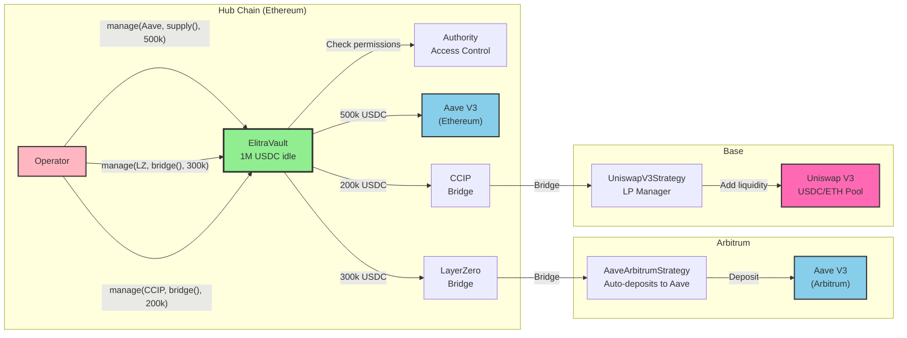
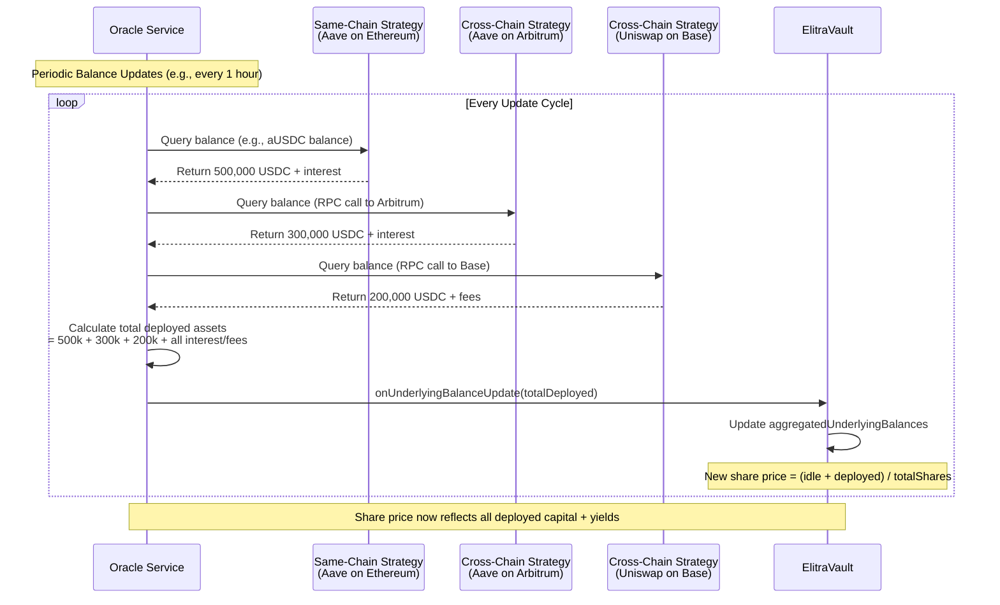

# Elitra Core - Cross-Chain Vault System

2025-11-03

## Executive Summary

Elitra Core is a **cross-chain ERC-4626 vault system** with pluggable bridge adapters for seamless omnichain deposits.

**Key Innovation:** Bridge-agnostic adapter pattern

- **Adapters:** LayerZero, Chainlink CCIP, Enso Finance (any token support)
- **Architecture:** Hub-and-spoke (single vault per asset on hub chain)
- **Integration:** Adapters use standard ElitraGateway deposit function

**Core Features:**

- Cross-chain deposits via LayerZero, CCIP, or Enso
- Multi-token support via Bridge Adapter (Zapper) (ETH, WBTC, etc. → vault deposit)
- One vault per asset type on hub chain (USDC vault, USDe vault, etc.)
- Async redemption queue for smooth liquidity management
- Oracle-based balance aggregation with 1% auto-pause safety
- Role-based access control
- No special whitelist needed for adapters

---

## Table of Contents

1. [System Architecture](#1-system-architecture)
2. [Bridge Adapters](#2-bridge-adapters)
3. [Core Vault Components](#3-core-vault-components)
4. [User Flows](#4-user-flows)
5. [Technical Specifications](#5-technical-specifications)
6. [Security Considerations](#6-security-considerations)

---

## 1. System Architecture

### 1.1 High-Level System Design



### 1.2 Architecture Flow Diagram



### 1.3 Design Principles

**Key Design Principles:**

1. **Bridge Agnostic:** Adapters are simple receivers that call standard `gateway.deposit()`
2. **Hub-and-Spoke:** Each vault lives on ONE hub chain (e.g., USDC vault on Ethereum)
3. **No Special Privileges:** Adapters don't need whitelist - they use public gateway functions
4. **Composability:** Deploy, upgrade, and add adapters independently

### 1.4 Architecture Decision: Hub-and-Spoke vs Multi-Vault

**Decision:** We chose **Hub-and-Spoke** architecture where each vault type lives on ONE hub chain.

#### Hub-and-Spoke Architecture (PROPOSING )

```
Hub Chain (Ethereum):
├─ USDC Vault (single instance)
├─ All vault state lives here
└─ Users deposit cross-chain via bridge adapters

Spoke Chains (Arbitrum, Base, etc.):
├─ Bridge adapters only
├─ NO vault contracts
└─ Users bridge assets to hub for deposits
```

**Pros:**

- ✅ **Single Source of Truth:** One vault contract, no state synchronization needed
- ✅ **Unified Liquidity:** All capital pooled together for better capital efficiency
- ✅ **Consistent Share Price:** Always identical for all users (no sync delays)
- ✅ **Simpler Strategy Management:** Operator manages ONE vault, easy rebalancing
- ✅ **Lower Maintenance:** One upgrade process, one contract to monitor
- ✅ **Easier Oracle Integration:** Oracle reports to ONE contract, no aggregation needed
- ✅ **Smaller Security Surface:** Fewer contracts to audit, fewer attack vectors
- ✅ **Proven Model:** LayerZero OVault uses this pattern successfully

**Cons:**

- ❌ **User Bridge Costs:** Users pay ~$10-20 bridge fees per cross-chain deposit
- ❌ **Slower UX:** 2-15 minute bridge confirmation time (not instant)
- ❌ **Shares Not Native on Spoke Chains:** Users must manually bridge shares for local DeFi use
- ❌ **Bridge Dependency:** System relies on bridge security and uptime
- ❌ **Hub Chain Concentration:** All assets concentrate on one chain

---

#### Multi-Vault Architecture (Alternative)

```
Each Chain Deploys:
├─ Full vault instance (Ethereum, Arbitrum, Base, etc.)
├─ Local vault state
├─ Local strategies
└─ Share tokens bridgeable via OFT

Cross-Chain Sync:
├─ Vaults report total assets to each other
├─ Each vault calculates global share price
└─ Oracle aggregates balances from all chains
```

**Pros:**

- ✅ **Zero Bridge Fees for Local Users:** Deposit locally with no bridge costs
- ✅ **Instant Deposits:** No bridge wait time
- ✅ **Native Share Composability:** Shares exist natively on each chain for local DeFi
- ✅ **Distributed Risk:** Assets spread across multiple chains
- ✅ **Fast Local Operations:** Instant deposits/redemptions when liquidity available

**Cons:**

- ❌ **Complex State Synchronization:** Must sync share price across all vaults (race conditions)
- ❌ **Fragmented Liquidity:** Assets split across chains, harder to fulfill large redemptions
- ❌ **Higher Deployment Overhead:** Deploy and maintain vault on every chain
- ❌ **Share Price Sync Risk:** Share price can diverge between chains, arbitrage opportunities
- ❌ **Higher Oracle Costs:** Must aggregate balances from all vaults across all chains
- ❌ **Larger Security Surface:** More contracts to audit, more attack vectors
- ❌ **Complex Accounting:** Track assets across multiple vaults, reconcile cross-chain balances
- ❌ **Difficult Upgrades:** Must upgrade all vaults in sync

---

#### Comparison Matrix

| Criteria                    | Hub-and-Spoke (✅)                        | Multi-Vault (❌) |
| --------------------------- | ----------------------------------------- | ---------------- |
| **User Gas Costs**          | ❌ ~$0.05 - 0.3u for a crosschain deposit | ✅ $0 local      |
| **Deposit Speed**           | ❌ 1-3 minutes                            | ✅ Instant       |
| **Vault Complexity**        | ✅ Single vault                           | ❌ State sync    |
| **Liquidity Fragmentation** | ✅ Unified                                | ❌ Fragmented    |
| **Strategy Management**     | ✅ Simple                                 | ❌ Complex       |
| **Oracle Complexity**       | ✅ One vault                              | ❌ Aggregate all |
| **Share Price Consistency** | ✅ Always same                            | ❌ Sync issues   |
| **Share Composability**     | ⚠️ Only on hub                            | ✅ Native        |
| **Security Surface**        | ✅ Minimal                                | ❌ Large         |
| **Deployment Overhead**     | ✅ Low                                    | ❌ High          |
| **Upgrade Complexity**      | ✅ One vault                              | ❌ All vaults    |

**Legend:** ✅ Advantage • ❌ Disadvantage • ⚠️ Neutral

---

#### Why Chose Hub-and-Spoke

**Priority: Correctness and security over gas optimization:**

1. **Simplicity:** Hub-and-spoke is simpler to implement, audit, and maintain
2. **Unified Liquidity:** Critical for yield optimization - strategies need full capital pool
3. **Consistent Share Price:** Non-negotiable - users must see identical prices
4. **Lower Maintenance:** Small team can manage one vault vs many
5. **Proven Security:** Battle-tested pattern (LayerZero OVault, major bridges)

**Trade-off Accepted:** Users pay ~$0.05 - 0.3u bridge fees, but get battle-tested architecture.

**Why One Asset Per Vault?**

1. **ERC-4626 Standard Compliance:** Designed for single-asset vaults
2. **Simplified Accounting:** No asset swapping or multi-asset price conversions
3. **Clear Performance Metrics:** Each vault has one APY for one asset
4. **Risk Isolation:** USDC strategies completely separate from USDe strategies

---

## 2. Bridge Adapters

### 2.1 Adapter Comparison

| Adapter              | Bridge Protocol | Input Token | Use Case                | Cost          | Speed     |
| -------------------- | --------------- | ----------- | ----------------------- | ------------- | --------- |
| **LayerZeroAdapter** | LayerZero OFT   | USDC only   | Fast, low-cost bridging | ~$0.05 - 0.3u | 2-5 min   |
| **CCIPAdapter**      | Chainlink CCIP  | USDC only   | Maximum security        | ~$0.10 - 0.5u | 10-15 min |
| **EnsoAdapter**      | Enso + Stargate | Any token   | Multi-token support     | ~$0.10 - 0.5u | 5-10 min  |

### 2.2 LayerZero Adapter

**Purpose:** Receives USDC from LayerZero OFT and deposits into vault

**Flow:**

1. User sends USDC via LayerZero OFT on spoke chain (Arbitrum, Base, etc.)
2. OFT bridges USDC to LayerZeroAdapter on hub chain (Ethereum)
3. Adapter receives via `lzReceive()` callback
4. Adapter approves USDC to ElitraGateway
5. Adapter calls `gateway.deposit()` (standard deposit flow)
6. Vault mints shares for user **on hub chain (Ethereum)**
7. **Shares stay on Ethereum** - user can bridge them manually if needed

**Contracts:**

- Hub: `LayerZeroAdapter.sol`
- Spoke: `ElitraUSDCOFT.sol` (per chain)

### 2.3 CCIP Adapter

**Purpose:** Receives USDC from Chainlink CCIP and deposits into vault

**Flow:**

1. User sends USDC via CCIP TokenPool on spoke chain
2. CCIP bridges USDC to CCIPAdapter on hub chain (Ethereum)
3. Adapter receives via `ccipReceive()` callback
4. Adapter approves USDC to ElitraGateway
5. Adapter calls `gateway.deposit()` (standard deposit flow)
6. Vault mints shares for user **on hub chain (Ethereum)**
7. **Shares stay on Ethereum** - user can bridge them manually if needed

**Contracts:**

- Hub: `CCIPAdapter.sol`
- Spoke: `ElitraCCIPBridge.sol` (per chain)

### 2.4 Enso Adapter

**Purpose:** Receives USDC from Enso cross-chain routing (after token swaps)

**Flow:**

1. User uses Enso Widget with any token (ETH, WBTC, etc.) on any chain
2. Enso swaps token → USDC on source chain
3. Enso bridges USDC via Stargate (LayerZero) to hub chain (Ethereum)
4. EnsoAdapter receives callback from Enso router
5. Adapter approves USDC to ElitraGateway
6. Adapter calls `gateway.deposit()` (standard deposit flow)
7. Vault mints shares for user **on hub chain (Ethereum)**
8. **Shares stay on Ethereum** - user can bridge them manually if needed

**Contracts:**

- Hub: `EnsoAdapter.sol`
- Spoke: Enso Widget (SDK/frontend integration)

---

## 3. Core Vault Components

### 3.1 ElitraVault

**Location:** Hub chain (Ethereum)

**Key Features:**

- Standard ERC-4626 deposit/withdraw/redeem
- Single asset type per vault (USDC, USDe, etc.)
- Async redemption queue
- Oracle-based cross-chain balance tracking
- Auto-pause on price changes > 1%
- Role-based access control

**Key Functions:**

```solidity
function deposit(uint256 assets, address receiver) returns (uint256 shares);
function requestRedeem(uint256 shares, address receiver, address owner) returns (uint256);
function fulfillRedeem(address receiver, uint256 shares, uint256 assets);
function onUnderlyingBalanceUpdate(uint256 newAggregatedBalance);
function manage(address target, bytes calldata data, uint256 value) returns (bytes memory);
```

### 3.2 ElitraGateway

**Location:** Hub chain (Ethereum)

**Purpose:** Single entrypoint for deposits and redemptions

**Key Features:**

- Accepts deposits from users and bridge adapters
- Validates vaults via ElitraRegistry
- Partner attribution tracking
- Uses existing deposit function (no special adapter logic)

**Key Functions:**

```solidity
function deposit(
    address vault,
    uint256 assets,
    uint256 minSharesOut,
    address receiver,
    uint32 partnerId
) returns (uint256 shares);

function redeem(
    address vault,
    uint256 shares,
    uint256 minAssetsOut,
    address receiver,
    uint32 partnerId
) returns (uint256 assetsOrRequestId);
```

### 3.3 ElitraRegistry

**Location:** Hub chain (Ethereum)

**Purpose:** Whitelist management for vaults

**Key Functions:**

```solidity
function addElitraVault(address vault);
function removeElitraVault(address vault);
function isElitraVault(address vault) returns (bool);
```

---

## 4. User Flows

### 4.1 Cross-Chain Deposit (Zap + Bridge)

**Concept:** Users can deposit from any chain using any supported token via bridge adapters and zapping services.

**General Flow:**

```
Step 1: User initiates deposit on spoke chain
  - User has tokens (USDC, ETH, WBTC, etc.) on any spoke chain (Arbitrum, Base, Optimism, etc.)
  - User interacts with bridge adapter or zapping service
  - Optionally: Token swap (if depositing non-vault token)
  - Bridge adapter bridges assets to hub chain (Ethereum)

Step 2: Bridge delivers to adapter on hub chain
  - Bridge validates and delivers assets to adapter
  - Adapter receives callback (lzReceive(), ccipReceive(), or custom callback)
  - Adapter has vault asset (e.g., USDC) ready

Step 3: Adapter deposits to vault
  - Adapter approves assets to ElitraGateway
  - Adapter calls: gateway.deposit(vault, assets, receiver, partnerId)
  - Vault mints shares for user on ETHEREUM (hub chain)

Result: User receives vault shares on ETHEREUM (hub chain)
Note: Shares stay on hub chain - users must bridge manually if needed on spoke chains
```

**Key Features:**

- **Protocol-Agnostic:** Not tied to specific bridge protocols (LayerZero, CCIP, Stargate, etc.)
- **Token-Agnostic:** Support any token via zapping services (swap → vault asset → bridge)
- **Chain-Agnostic:** Support any chain with bridge integrations
- **Composable:** Easy to add new bridges or zappers as adapters

### 4.2 Redemption with Queue

**Scenario:** User redeems shares but vault has insufficient liquidity



**Flow Steps:**

```
Step 1: User requests redemption
  - User calls gateway.redeem(vault, shares, minAssets, receiver, partnerId)
  - Gateway calls vault.requestRedeem(shares, receiver, owner)
  - Vault calculates assets owed: shares × sharePrice
  - Vault checks idle liquidity (not deployed to strategies)
  - If sufficient idle assets: instant redemption (assetsOut > 0)
  - If insufficient idle assets: queued request (requestId returned)

Step 2: Operator fulfills request (if queued)
  - Operator monitors redemption queue
  - Withdraws assets from strategies if needed
  - Calls: vault.fulfillRedeem(receiver, shares, assets)
  - Assets transferred to user

Result: User receives assets (instant or queued)
Queue time: Typically 6-24 hours
Note: Share price is based on oracle updates (see section 4.4)
```

### 4.3 Strategy Management via manage()

**Scenario:** Operator allocates vault assets to yield strategies (same-chain or cross-chain)



#### Example A: Same-Chain Strategy (Aave on Ethereum)

```
Step 1: Operator allocates to Aave
  - Vault has 1M USDC idle on Ethereum
  - Operator calls: vault.manage(
      target: AaveV3Pool,
      data: supply(USDC, 500k),
      value: 0
    )

Step 2: Vault executes
  - Vault checks: authority().canCall(operator, AaveV3Pool, supply())
  - Vault approves 500k USDC to Aave
  - Vault calls: AaveV3Pool.supply(USDC, 500k)
  - Vault receives aUSDC (Aave interest-bearing token)

Result: 500k USDC earning yield on Aave
Oracle: Reports 500k + interest to aggregatedUnderlyingBalances
```

#### Example B: Cross-Chain Strategy (Aave on Arbitrum via LayerZero)

```
Step 1: Operator bridges assets to Arbitrum
  - Vault has 1M USDC on Ethereum
  - Operator calls: vault.manage(
      target: LayerZeroBridge,
      data: bridge(USDC, 300k, Arbitrum, AaveArbitrumStrategy),
      value: 0.01 ETH (bridge fee)
    )

Step 2: LayerZero bridges
  - Vault approves 300k USDC to LayerZero
  - LayerZero bridges USDC to Arbitrum
  - Delivers to AaveArbitrumStrategy contract

Step 3: Strategy contract on Arbitrum
  - AaveArbitrumStrategy receives 300k USDC
  - Auto-deposits into Aave on Arbitrum
  - Holds aUSDC on behalf of vault

Result: 300k USDC earning yield on Aave (Arbitrum)
Oracle: Monitors AaveArbitrumStrategy balance on Arbitrum
        Reports to vault's aggregatedUnderlyingBalances
```

#### Example C: Cross-Chain Strategy (Uniswap V3 on Base via CCIP)

```
Step 1: Operator allocates to Uniswap V3 LP
  - Vault has 1M USDC on Ethereum
  - Operator calls: vault.manage(
      target: CCIPBridge,
      data: bridge(USDC, 200k, Base, UniswapV3Strategy),
      value: 0.02 ETH (CCIP fee)
    )

Step 2: CCIP bridges
  - Vault approves 200k USDC to CCIP
  - CCIP bridges USDC to Base
  - Delivers to UniswapV3Strategy contract

Step 3: Strategy contract on Base
  - UniswapV3Strategy receives 200k USDC
  - Adds liquidity to USDC/ETH pool
  - Receives LP NFT position

Result: 200k USDC in Uniswap V3 LP earning fees
Oracle: Monitors UniswapV3Strategy position value on Base
        Reports to vault's aggregatedUnderlyingBalances
```

**Key Points:**

- `manage()` is a flexible function for ANY strategy deployment
- Same-chain: Direct protocol calls (Aave, Compound, Morpho, etc.)
- Cross-chain: Bridge assets first, then strategy executes on destination
- Authority checks ensure only whitelisted target contracts can be called
- Oracle tracks all cross-chain positions for accurate share pricing

### 4.4 Oracle Balance Updates

**Scenario:** Oracle service maintains accurate vault share price by tracking assets deployed to strategies



**Flow Steps:**

```
Step 1: Oracle queries all strategy balances
  - Same-chain strategies: Direct contract calls (e.g., Aave.balanceOf())
  - Cross-chain strategies: RPC calls to other chains (Arbitrum, Base, etc.)
  - Queries all positions: lending (Aave), LP (Uniswap), staking, etc.

Step 2: Oracle aggregates total deployed assets
  - Sum all strategy balances across all chains
  - Include accrued interest, LP fees, staking rewards
  - Calculate: totalDeployed = strategy1 + strategy2 + ... + strategyN

Step 3: Oracle reports to vault
  - Call: vault.onUnderlyingBalanceUpdate(totalDeployed)
  - Vault updates: aggregatedUnderlyingBalances = totalDeployed
  - Vault recalculates share price: (idle + aggregated) / totalShares

Result: Vault maintains accurate share price reflecting all deployed capital
Update frequency: Typically every 1 hour (configurable)
```

**Key Points:**

- **Share Price Formula**: `sharePrice = (idleAssets + aggregatedUnderlyingBalances) / totalShares`
- **Oracle tracks**: Same-chain strategies (direct calls) and cross-chain strategies (RPC calls)
- **Critical for**: Accurate redemption pricing, deposit share calculation, vault APY reporting
- **Update frequency**: Configurable (typically 1 hour, more frequent during high volatility)
- **Strategy balance includes**: Principal + accrued yields (interest, fees, rewards)
- **Cross-chain tracking**: Oracle must have RPC access to all chains where strategies are deployed
