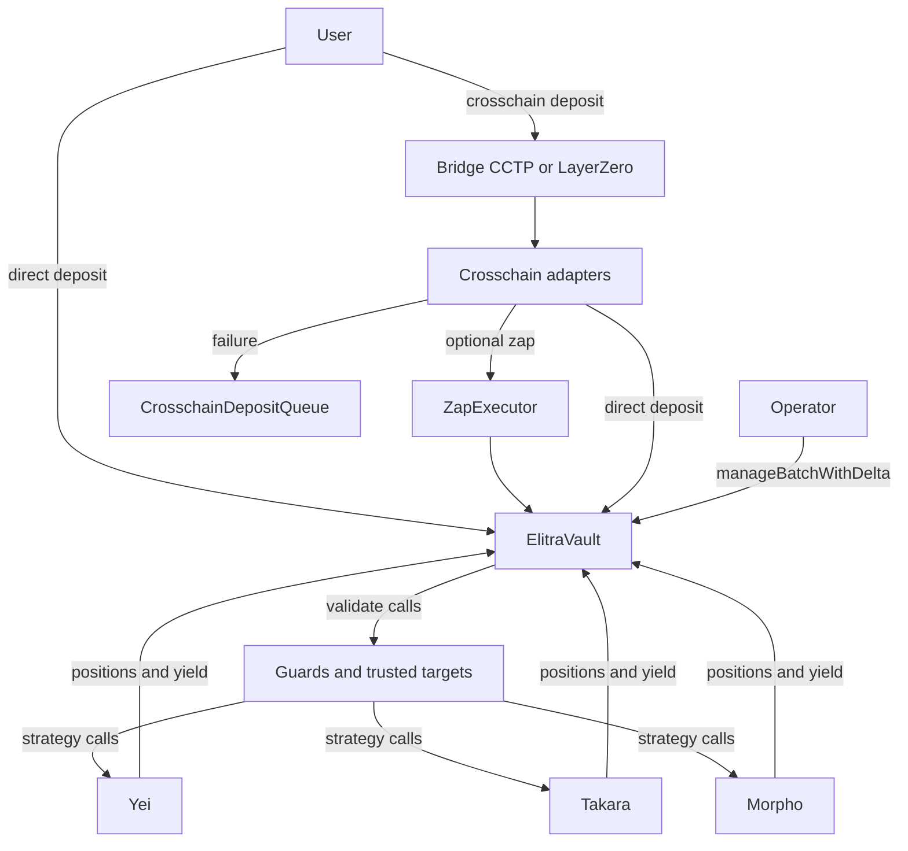

# Elitra Core - System Architecture

ELI5: Elitra is a smart vault. You deposit one token, and operators move funds into approved strategies to earn yield. The vault only allows pre-approved actions and can pause or queue withdrawals if something looks risky.

## What It Does

- ERC-4626 vault on SEI with guarded strategy execution.
- Cross-chain deposits via CCTP and LayerZero adapters.
- Hook-based oracle updates for NAV/PPS and redemption handling.
- Fee system with pending asset fees and share-based management/performance fees.

## Core Components (How They Relate)

Specs: [specs/guardrail.md](specs/guardrail.md), [specs/manage-security.md](specs/manage-security.md), [specs/oracle.md](specs/oracle.md), [specs/crosschain.md](specs/crosschain.md), [specs/fees.md](specs/fees.md), [specs/swap-adapter.md](specs/swap-adapter.md)

- **ElitraVault** (`src/ElitraVault.sol`): user-facing ERC-4626 vault; owns deposits, redemptions, fees, and hooks.
- **VaultBase** (`src/vault/VaultBase.sol`): auth + guarded batch execution (`manageBatchWithDelta`).
- **Guards** (`src/guards/*`): per-target call validators; optional trusted-target allowlist in `VaultBase`.
- **Hooks** (`src/hooks/*`):
  - Balance update hook validates NAV updates and can auto-pause.
  - Redemption hook decides instant vs queued redemptions.
- **Fees** (`src/fees/*`): asset fees + management/performance share fees.
- **Cross-chain adapters** (`src/crosschain-adapters/*`): CCTP + LayerZero adapters receive bridged funds, optionally zap, and deposit into the vault.
- **Hub-chain adapters** (`src/adapters/*`): SEI-facing helpers like `Api3SwapAdapter` for vault-managed swaps.
- **ZapExecutor / Api3SwapAdapter**: ZapExecutor is used for cross-chain deposits with no price checks; Api3SwapAdapter is used for vault swaps with API3 validation.
- **CrosschainDepositQueue**: records failed deposits for refund/fulfillment.

### Flow (How Components Connect)

Flow summary:
- Users deposit/mint into `ElitraVault`; fees are tracked via `FeeManager` + `FeeRegistry`.
- Balance updates go through the balance update hook; redemptions go through the redemption hook.
- Operators call `manageBatchWithDelta` on the vault; guarded calls are enforced by guards/trusted targets.
- Cross-chain deposits arrive via CCTP/LayerZero adapters (`src/crosschain-adapters`), optionally zap via `ZapExecutor`, then deposit into the vault; failures go to `CrosschainDepositQueue`.
- Vault-managed swaps use `Api3SwapAdapter` (`src/adapters`) with API3 validation.

Mermaid: Components and Flow

```mermaid
flowchart TB
    User[User] -->|direct deposit| Vault[ElitraVault]
    User -->|crosschain deposit| Bridge[Bridge CCTP or LayerZero]
    Bridge --> XAdapter[Crosschain adapters]
    XAdapter -->|optional zap| ZapExec[ZapExecutor]
    ZapExec --> Vault
    XAdapter -->|direct deposit| Vault
    XAdapter -->|failure| Queue[CrosschainDepositQueue]

    Operator[Operator] -->|manageBatchWithDelta| Vault
    Vault -->|validate calls| Guards[Guards and trusted targets]
    Guards -->|strategy calls| Yei[Yei]
    Guards -->|strategy calls| Takara[Takara]
    Guards -->|strategy calls| Morpho[Morpho]

    Yei -->|positions and yield| Vault
    Takara -->|positions and yield| Vault
    Morpho -->|positions and yield| Vault
```

## Actors

- **LP / Depositor**: deposits and redeems; no privileged rights.
- **Strategy Operator / Bot**: executes `manageBatchWithDelta` for strategy operations.
- **Admin / Governance**: configures fees, guards, trusted targets, hooks, and adapter allowlists; can pause/unpause.
- **Guardian (optional)**: emergency pause actions only.
- **Oracle / Updater**: posts balance updates used for PPS/NAV.

## License

UNLICENSED - All rights reserved. No license granted.
