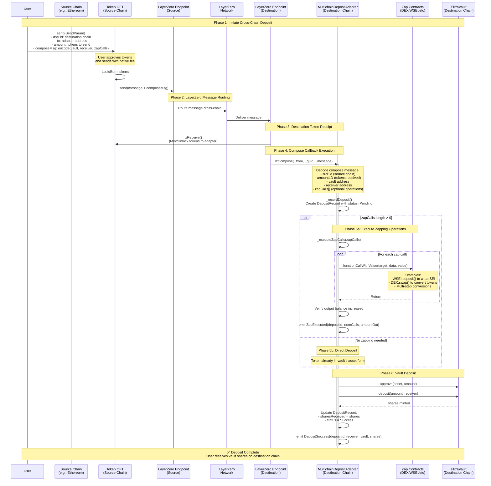
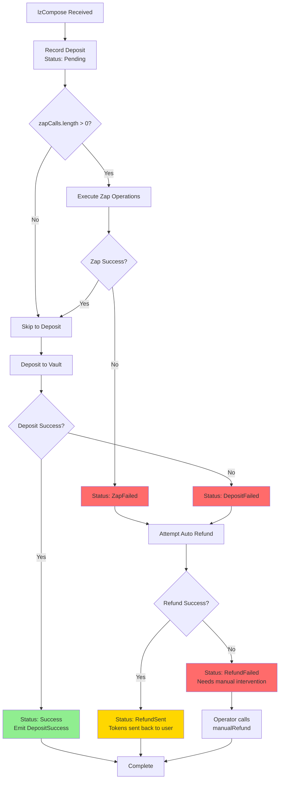
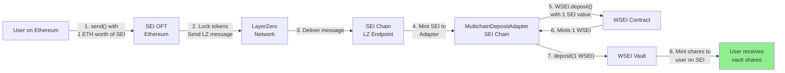

# Multichain Deposit Flow

This document explains the cross-chain deposit flow for Elitra vaults using LayerZero V2 OFT (Omnichain Fungible Token) with compose messages.

## Overview

The multichain deposit system allows users to deposit assets from any supported chain into Elitra vaults on the destination chain (e.g., SEI). The system supports optional "zapping" - executing arbitrary token conversions before depositing into the vault.

## Architecture Flow



## Detailed Component Breakdown

### 1. User Initiation (Source Chain)

The user initiates the deposit by calling the OFT contract on the source chain:

```solidity
// Build compose message with deposit parameters
bytes memory composeMsg = abi.encode(
    vaultAddress,    // Target vault on destination chain
    receiverAddress, // Who receives the vault shares
    zapCalls         // Array of operations to execute before deposit
);

// Build SendParam for LayerZero
SendParam memory sendParam = SendParam({
    dstEid: destinationChainId,           // e.g., SEI chain
    to: bytes32(adapterAddress),          // MultichainDepositAdapter
    amountLD: amount,                     // Tokens to send
    minAmountLD: amountWithSlippage,      // Slippage protection
    extraOptions: executionOptions,       // Gas settings
    composeMsg: composeMsg,               // Our custom payload
    oftCmd: ""                            // Standard send
});

// Execute with native fee
OFT.send{value: nativeFee}(sendParam, fee, refundAddress);
```

### 2. LayerZero Message Processing

- **Source Endpoint**: Validates message, locks/burns tokens
- **Network**: Routes message across chains via DVNs (Decentralized Verifier Networks)
- **Destination Endpoint**: Verifies and delivers message

### 3. Compose Callback (lzCompose)

The adapter receives the compose callback after tokens are minted:

```solidity
function lzCompose(
    address _from,        // OFT contract address
    bytes32 _guid,        // Unique message ID
    bytes calldata _message, // OFT compose format
    address,              // executor
    bytes calldata        // extraData
) external payable {
    // Decode OFT message structure
    uint32 srcEid = OFTComposeMsgCodec.srcEid(_message);
    uint256 amountLD = OFTComposeMsgCodec.amountLD(_message);
    bytes memory composeMsg = OFTComposeMsgCodec.composeMsg(_message);

    // Decode our custom payload
    (address vault, address receiver, Call[] memory zapCalls) =
        abi.decode(composeMsg, (address, address, Call[]));

    // Process the deposit...
}
```

### 4. Zapping Operations (Optional)

The adapter can execute arbitrary operations to convert received tokens into the vault's asset:

**Example 1: Wrap Native SEI to WSEI**
```solidity
zapCalls[0] = Call({
    target: WSEI_ADDRESS,
    value: amount,
    data: abi.encodeWithSignature("deposit()")
});
```

**Example 2: Swap via DEX**
```solidity
zapCalls[0] = Call({
    target: DEX_ROUTER,
    value: 0,
    data: abi.encodeCall(
        router.swap,
        (tokenIn, tokenOut, amount, minOut, deadline)
    )
});
```

**Example 3: Multi-step Conversion**
```solidity
zapCalls[0] = Call({ /* Wrap native token */ });
zapCalls[1] = Call({ /* Approve DEX */ });
zapCalls[2] = Call({ /* Swap to final asset */ });
```

### 5. Vault Deposit

After zapping (or directly if no zap needed), deposit into the vault:

```solidity
function _depositToVault(
    address vault,
    address receiver,
    uint256 amount
) internal returns (uint256 shares) {
    address asset = IElitraVault(vault).asset();

    // Approve vault
    IERC20(asset).forceApprove(vault, amount);

    // Deposit and mint shares to receiver
    shares = IElitraVault(vault).deposit(amount, receiver);
}
```

## Error Handling & Refunds



### Automatic Refund System

If any step fails, the adapter attempts to refund tokens to the user:

```solidity
function _attemptRefund(uint256 depositId) internal {
    DepositRecord storage record = depositRecords[depositId];

    // Build refund parameters
    SendParam memory sendParam = SendParam({
        dstEid: record.srcEid,        // Back to source chain
        to: record.user,               // Original user
        amountLD: record.amountIn,     // Full amount
        minAmountLD: amountWithSlippage,
        extraOptions: "",
        composeMsg: "",                // No compose on refund
        oftCmd: ""
    });

    // Send tokens back via OFT
    IOFT(oft).send{value: fee}(sendParam, fee, payable(this));
}
```

## Deposit Record Tracking

Every deposit is tracked with a complete audit trail:

```solidity
struct DepositRecord {
    address user;              // Share receiver
    uint32 srcEid;            // Source chain ID
    address tokenIn;          // Received token
    uint256 amountIn;         // Received amount
    address vault;            // Target vault
    uint256 sharesReceived;   // Vault shares (0 if failed)
    uint256 timestamp;        // Deposit time
    DepositStatus status;     // Current status
    bytes32 guid;             // LayerZero message ID
    bytes failureReason;      // Error data if failed
}
```

### Status Flow

```
Pending → Success                    (Happy path)
Pending → ZapFailed → RefundSent     (Zap fails, refund succeeds)
Pending → ZapFailed → RefundFailed   (Zap fails, refund fails - needs manual)
Pending → DepositFailed → RefundSent (Deposit fails, refund succeeds)
```

## Gas Profiling

LayerZero requires gas to be specified for both receive and compose operations:

```solidity
// lzReceive gas (token minting)
bytes memory lzReceiveOption = abi.encodePacked(
    uint128(200000),  // gas limit
    uint128(0)        // msg.value
);

// lzCompose gas (zap + deposit)
bytes memory lzComposeOption = abi.encodePacked(
    uint16(0),         // index
    uint128(1200000),  // gas limit (higher for complex operations)
    uint128(0)         // msg.value
);
```

## Security Features

1. **Pausable**: Admin can pause all operations
2. **Reentrancy Protection**: All external calls protected
3. **Vault Whitelisting**: Only approved vaults can be targeted
4. **OFT Whitelisting**: Only approved OFT contracts accepted
5. **Access Control**: Owner + Operator roles
6. **Automatic Refunds**: Failed operations trigger refunds
7. **Manual Recovery**: Operators can manually refund stuck deposits
8. **Emergency Recovery**: Owner can recover stuck tokens

## Example: Cross-Chain SEI → WSEI Vault Deposit



## Manual Operations

### Query Failed Deposits

```solidity
// Get failed deposits needing manual intervention
uint256[] memory failed = adapter.getFailedDeposits(startId, limit);

// Get specific deposit details
DepositRecord memory record = adapter.getDepositRecord(depositId);
```

### Manual Refund

```solidity
// Single refund (operator only)
adapter.manualRefund(depositId);

// Batch refund
uint256[] memory depositIds = [1, 5, 7, 12];
adapter.batchManualRefund(depositIds);
```

### Quote Refund Fee

```solidity
// Check how much ETH needed for refund
uint256 nativeFee = adapter.quoteRefundFee(depositId);

// Deposit ETH to cover refund gas
adapter.depositRefundGas{value: 1 ether}();
```

## Integration Guide

### For Users (via SDK)

```typescript
// 1. Build zap calls based on desired conversion
const zapCalls = buildZapCalls(tokenIn, vaultAsset, amount);

// 2. Encode compose message
const composeMsg = ethers.AbiCoder.defaultAbiCoder().encode(
  ['address', 'address', 'tuple(address,uint256,bytes)[]'],
  [vaultAddress, receiverAddress, zapCalls]
);

// 3. Send via OFT
const sendParam = {
  dstEid: SEI_CHAIN_ID,
  to: adapterAddress,
  amountLD: amount,
  minAmountLD: amountWithSlippage,
  extraOptions: buildOptions(),
  composeMsg: composeMsg,
  oftCmd: '0x'
};

await oft.send(sendParam, fee, refundAddress, { value: nativeFee });
```

### For Operators

1. **Monitor Deposits**: Track deposit records and watch for failed statuses
2. **Maintain Gas Reserve**: Keep ETH in adapter for refunds via `depositRefundGas()`
3. **Handle Failed Deposits**: Use `batchManualRefund()` for stuck deposits
4. **Vault Management**: Whitelist new vaults via `setSupportedVault()`
5. **OFT Management**: Whitelist OFT contracts via `setSupportedOFT()`

## Key Contracts

- **MultichainDepositAdapter**: Main adapter contract (upgradeable)
  - Location: `src/MultichainDepositAdapter.sol`
  - Implements: `IOAppComposer`, `IMultichainDepositAdapter`

- **IMultichainDepositAdapter**: Interface
  - Location: `src/interfaces/IMultichainDepositAdapter.sol`

- **CrossChainDeposit_SEI_WSEI**: Example deployment script
  - Location: `script/CrossChainDeposit_SEI_WSEI.s.sol`

## Advantages

1. **Flexibility**: Support any token conversion via zap calls
2. **User Experience**: Single transaction from source chain
3. **Gas Efficiency**: Batch operations on destination
4. **Reliability**: Automatic refunds on failure
5. **Extensibility**: Easy to add new chains/vaults
6. **Auditability**: Complete deposit tracking
7. **Safety**: Multiple layers of error handling
