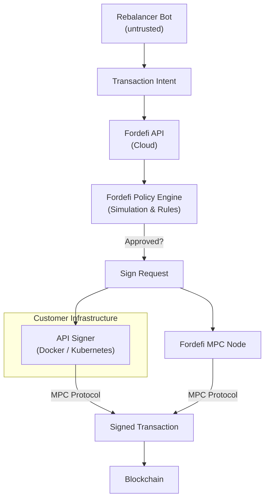

# 3. Policy-Gated Signer (Fordefi)

## Executive Summary

**Fordefi** provides an institutional-grade signing infrastructure that enforces a **"Two-Man Rule"** for every transaction. It combines a cloud-based Policy Engine with a self-hosted API Signer to ensure that neither the customer nor Fordefi can unilaterally move funds.

*   **Primary Benefit:** **Non-Custodial Security.** Fordefi holds one key share; you hold the other. If Fordefi is compromised, your funds remain safe.
*   **Operational Model:** **Fully Automated.** The "second man" is a Docker container running in your infrastructure that automatically co-signs valid policy-approved transactions in <500ms.
*   **Trade-off:** **Availability.** You must maintain high availability for your API Signer. If your server goes offline, signing operations halt.

---

## 1. Architecture & Design

### Core Principle
> **The API proposes, the Policy Engine validates, the API Signer co-signs.**

Security is enforced by a mandatory **simulation & policy check** before the transaction is presented to the MPC nodes for signing.

### Diagram


### Components

#### 1. Rebalancer Bot (Untrusted)
*   **Role:** Constructs transaction intents (e.g., "Swap 100 USDC for ETH") and submits them to the Fordefi API.
*   **Constraints:** Holds an API User Key which allows *requests* but not *signing*. Cannot bypass the Policy Engine.

#### 2. Fordefi Platform (Policy & Orchestration)
*   **Role:** Simulates transactions block-by-block to predict outcomes (slippage, balance changes) and checks them against defined Policies.
*   **Capabilities:** Enforces rules like "Only allow Uniswap V3 Router", "Max 10 ETH/hour", or "Revert if slippage > 1%".

#### 3. API Signer (Self-Hosted Trust Anchor)
*   **Role:** Holds **Share B** of the MPC private key. Runs in customer infrastructure (AWS/GCP).
*   **Behavior:** Acts as an automated gatekeeper. It verifies that the signing request originated from a valid, policy-approved Fordefi session and co-signs instantly.

---

## 2. Security Model

### The "Two-Man Rule" (MPC 2-of-2)
The private key is cryptographically split into two shares using Multi-Party Computation (MPC).
1.  **Share A:** Held by Fordefi (Cloud).
2.  **Share B:** Held by Customer (API Signer).

**Requirement:** Both shares must participate in the MPC protocol to generate a valid signature. Neither share is ever revealed to the other party.


---

## 3. Operational Specifics

### Terminology Hierarchy
1.  **Organization:** Root account (e.g., "Elitra Protocol").
2.  **Vault:** The asset container (equivalent to a "Wallet" in other systems). Holds the on-chain address.
3.  **Vault Group:** Logical grouping of Vaults for policy assignment (e.g., "Trading Vaults").
4.  **User:** An entity (Human or Bot/API) that interacts with Vaults.

### Policy Configuration
Fordefi uses a rule-based engine. A typical policy for an automated bot would be:

*   **Condition:** `Initiator == "Bot User" AND Contract == "0xE592..." (Uniswap) AND Method == "exactInputSingle"`
*   **Action:** `Allow & Auto-Sign`

### Automation ("Happy Path")
In normal operation, the process is 100% automated with sub-second latency:
1.  **Bot** submits request.
2.  **Fordefi** simulates & approves (Policy Check).
3.  **Fordefi** signs Share A.
4.  **API Signer** receives signal, verifies context, and signs Share B.
5.  **Result:** Transaction broadcasted.

---

## 4. Implementation Reference

### Docker Compose (API Signer)
```yaml
version: '3'
services:
  fordefi-signer:
    image: fordefiregistry.azurecr.io/signer:latest
    environment:
      - SIGNER_NAME=production-signer-01
      - FORDEFI_API_URL=https://api.fordefi.com
    volumes:
      - ./storage:/app/storage
    restart: always
```

### TypeScript (Bot Integration)
```typescript
import { FordefiWeb3Provider, FordefiProviderConfig } from "@fordefi/web3-provider";

const config: FordefiProviderConfig = {
  apiUserToken: process.env.FORDEFI_API_USER_TOKEN!,
  apiBaseUrl: "https://api.fordefi.com",
  chainId: 1,
};

const provider = new FordefiWeb3Provider(config);
const signer = provider.getSigner();

async function executeTrade() {
    try {
        // Sends to Fordefi -> Policy Check -> API Signer -> Blockchain
        const tx = await signer.sendTransaction({
            to: "0xE592...", 
            data: "0x..."
        });
        console.log("Tx Sent:", tx.hash);
    } catch (err) {
        console.error("Blocked by Policy:", err);
    }
}
```

## References
https://docs.fordefi.com/developers/getting-started/set-up-an-api-signer

https://docs.fordefi.com/user-guide/policies/sample-policies
