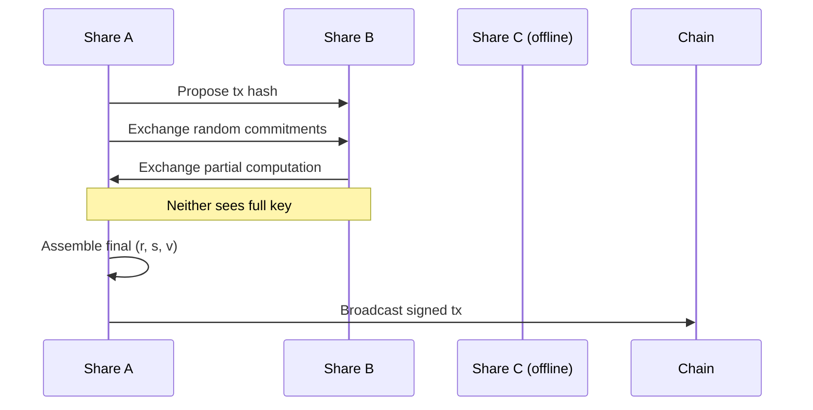
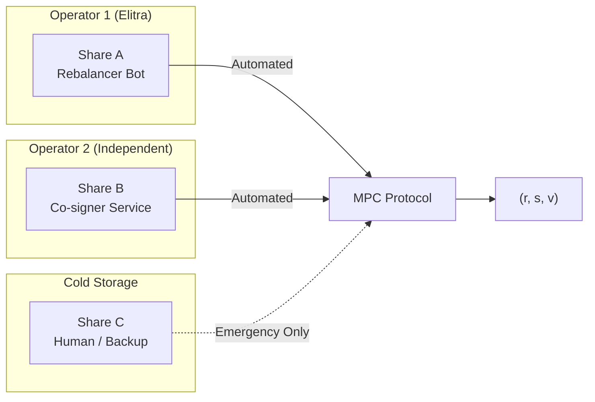

# 4. MPC (Multi-Party Computation) Wallets

## What is MPC?

**MPC is a key custody model**, not a policy framework.

> **The private key never exists.** Instead, it is split into **shares** held by different parties. To sign, multiple parties collaborate without ever reconstructing the full key.

---

## Core Concept

```
Traditional Key:    [FULL PRIVATE KEY] → sign(tx)

MPC Key:            [Share A] + [Share B] + [Share C]
                           ↓
                    Collaborative Protocol
                           ↓
                    Valid Signature (r, s, v)
```

No single share can produce a signature.
No party ever sees the full key.

---

## Threshold Schemes

MPC uses **t-of-n** threshold schemes:

| Scheme | Meaning |
|--------|---------|
| 2-of-3 | Any 2 shares can sign |
| 3-of-5 | Any 3 shares can sign |
| 2-of-2 | Both shares required |

The remaining shares are for redundancy/recovery.

---

## How Signing Works

1. **Key Generation (DKG):** Shares are created collaboratively — the full key never exists
2. **Signing Request:** A party proposes a transaction
3. **Interactive Protocol:** Participating shares exchange commitments and partial computations
4. **Signature Assembly:** If threshold is met, a valid ECDSA signature is produced



---

## Elitra MPC Configuration (2-of-3)

> [!IMPORTANT]
> For MPC to add security over Policy-Gated KMS, shares must be held by **independent operators**.



**Why independence matters:**

| Same Trust Domain ❌ | Independent ✅ |
|---------------------|----------------|
| Bot + Policy on same AWS | Bot (AWS) + Co-signer (GCP) |
| Same team operates both | Different teams / orgs |
| Single compromise = 2 shares | Must compromise 2 orgs |

**Normal operation:** Bot + Independent Co-signer sign together (A + B).

**Recovery / Override:** Human (Share C) + any one automated share.

---

## MPC vs Other Key Models

| Model | Key Exists? | Single Point of Failure? |
|-------|-------------|--------------------------|
| Hot Wallet | ✅ Yes (in memory) | ✅ Yes |
| HSM | ✅ Yes (in hardware) | ✅ Yes (the HSM) |
| Multisig | ✅ Yes (per signer) | ❌ No |
| **MPC** | ❌ Never | ❌ No |

---

## Security Properties

| Threat | Outcome |
|--------|---------|
| Single share compromised | Cannot sign (threshold not met) |
| Attacker steals backup | Cannot sign alone |
| Insider with one share | Needs collusion |
| Key extraction | **Impossible** — key never exists |

---

## MPC vs Policy

These are **separate concerns**:

| Concept | Question Answered |
|---------|-------------------|
| MPC | "WHO holds the signing shares?" |
| Policy | "WHAT transactions are allowed?" |

You can have:
- MPC **without** policy (e.g., 3 humans signing manually)
- Policy **without** MPC (e.g., Policy Engine + single HSM)
- MPC **with** policy (e.g., Share B = Policy Engine)

---

## Tradeoffs

**Pros**
- No single point of failure
- No key to extract
- Strong insider resistance
- Institutional-grade guarantees

**Cons**
- High cost (vendor services)
- Vendor lock-in (Fireblocks, Fordefi, Lit Protocol, etc.)
- Latency (interactive protocol)
- Operational complexity

---


---

## Summary

MPC is about **how the key is held**, not about what transactions are allowed.

Policy can be layered on top of MPC, but they solve different problems:

- **MPC** = No key ever exists
- **Policy** = Only approved transactions can be signed

For maximum security, use both.

---

## References

### MPC Providers (Automated Backend Ops)

| Provider | Best For |
|----------|----------|
| [Fireblocks](https://www.fireblocks.com/) | Enterprise: API-driven signing, policy engine, 100+ blockchains |
| [Fordefi](https://www.fordefi.com/) | DeFi-native: Built-in tx simulation, smart contract insights |
| [Dfns](https://www.dfns.co/) | Developer-first: REST API, programmatic key management |
| [Binance Web3 Wallet](https://www.binance.com/en/web3wallet) | Consumer MPC: 3-party key sharding (user device, Binance cloud, recovery) |

### Real-World Automated Operations

| Entity | Use Case |
|--------|----------|
| [Jump Crypto / Cordial Systems](https://cordialsystems.com/) | Built wallet-ops platform managing thousands of automated on-chain transfers for trading. Customizable allowlists + transfer policies. |
| [Wintermute](https://wintermute.com/) | Automated market making & DeFi liquidity. Uses Hypernative for real-time policy enforcement on farming portfolios. |

