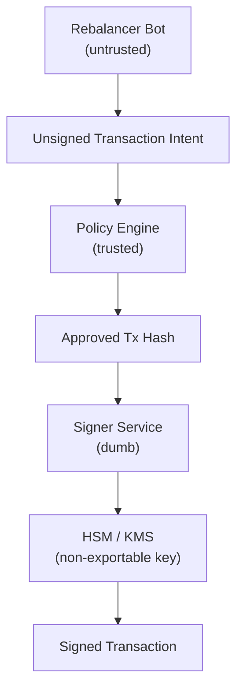

# 3. Policy-Gated Signer (HSM / KMS)

## Purpose

Enable **fully automated EVM operations** (rebalancing, market making, vault ops) while ensuring that **key compromise does not imply fund loss**.

This design is the **industry baseline for professional DeFi operators**.

---

## Core Principle

> **The signer never decides, and the bot never signs.**

Security is enforced by **deterministic policy before signing**, not by secrecy of the key.

---

## Architecture Overview



---

## Components

### 1. Rebalancer Bot (Untrusted)

**Responsibilities**

* Observe market state
* Compute rebalance strategy
* Construct unsigned transaction intent

**Never allowed**

* Access private keys
* Call HSM directly
* Override policy decisions

Compromise impact: **strategy manipulation only**, not fund theft.

---

### 2. Policy Engine (Security Boundary)

**Responsibilities**

* Deterministically validate transaction intent
* Enforce hard safety constraints

**Typical rules**

* Allowlist destination contracts
* Allowlist function selectors
* Enforce calldata shape
* Enforce chainId
* Enforce nonce monotonicity
* Cap gas, value, and frequency
* Reject dangerous opcodes (upgrade, delegatecall, selfdestruct)

**Output**

* Approved transaction hash
* Policy approval metadata
* Audit log

If policy rejects → **no signature is possible**.

---

### 3. Signer Service (Minimal)

**Responsibilities**

* Accept only policy-approved tx hashes
* Forward hash to HSM
* Return signature

**Constraints**

* No calldata parsing
* No tx construction
* Rate-limited
* IAM-restricted (`Sign` only)

---

### 4. AWS KMS (Recommended)

**Design Choice:** We use **AWS KMS** as the signing backend.

**Key properties**

* Non-exportable ECDSA key (secp256k1)
* Sign-only usage
* Isolated from application logic
* HSM-backed (FIPS 140-2 Level 3)

**Why KMS over CloudHSM**

| Dimension | CloudHSM | AWS KMS |
|-----------|----------|---------|
| Key security | ✅ Maximum | ✅ Very high |
| secp256k1 | ✅ Native | ⚠️ Requires normalization |
| IAM integration | ❌ No | ✅ Yes |
| Ops burden | ❌ High | ✅ Low |
| Cost | ❌ Expensive | ✅ Pay-per-request |

> [!IMPORTANT]
> **Neither HSM nor KMS enforces transaction policy.**
> Policy is your Policy Engine's job. KMS only answers "HOW to sign".

---

### Security Layer Separation

| Layer | Question | Example |
|-------|----------|---------|
| **IAM** | "WHO may call Sign?" | Only `policy-engine-role` |
| **Policy Engine** | "WHAT may be signed?" | Only `swap()` on Uniswap Router |
| **KMS** | "HOW to sign?" | secp256k1 ECDSA (just math) |

> [!WARNING]
> **IAM is necessary but never sufficient.**
> If a compromised service has `kms:Sign`, IAM will happily sign a drain tx.
> The Policy Engine is the real security boundary.

---

### secp256k1 Implementation Notes

AWS KMS supports `ECC_SECG_P256K1` but has quirks:

* **Low-s normalization:** EVM requires `s` in the lower half of the curve order. KMS does not guarantee this. You may need a normalization layer.
* **Signature format:** KMS returns DER-encoded signatures. You must convert to `(r, s, v)` for EVM.
* **Recovery ID (v):** KMS does not return `v`. You must compute it by trying both recovery IDs.

**Recommendation:** Use an adapter library (e.g., `ethers-aws-kms-signer`) or implement normalization in your Signer Service.

---

## Security Guarantees

| Threat             | Outcome                                |
| ------------------ | -------------------------------------- |
| Bot compromised    | Policy blocks malicious tx             |
| Signer compromised | Cannot bypass policy                   |
| Key stolen         | Impossible (non-exportable)            |
| Policy bug         | Blast radius limited by vault contract |

---

## When to Use

* Automated vaults
* Rebalancing systems
* Market-making bots
* TVL up to tens of millions

---

## Limitations

* Single cryptographic root of trust
* Policy bugs still dangerous (but bounded)
* Insider risk exists if signer + policy both compromised

---

## Summary

This design is:

* Flexible
* Auditable
* Cost-efficient
* Widely used in production DeFi

It is the **recommended default** for serious automated systems.

---

## Implementation Reference (TypeScript)

> [!NOTE]
> Simplified pseudocode showing the flow. See full implementation in `/src/policy-signer/`.

### 1. Bot → Policy Engine

```typescript
// bot/rebalancer.ts (UNTRUSTED - no key access)

async function buildAndSubmitIntent() {
  const intent = {
    to: UNISWAP_ROUTER,
    data: encodeSwapCalldata(amount),
    value: 0n,
    chainId: 1,
  };

  // Submit to Policy Engine (NOT to signer directly)
  const approval = await policyEngine.evaluate(intent);
  if (!approval) throw new Error("Policy rejected");
  
  return { intent, approval };
}
```

---

### 2. Policy Engine (Simulation + Rules)

```typescript
// policy/engine.ts (TRUSTED - validates before signing)

async function evaluate(intent: TransactionIntent): Promise<PolicyApproval | null> {
  // Phase 1: Static rules (fast)
  if (!isWhitelisted(intent.to)) return null;
  if (!isAllowedSelector(intent.data)) return null;
  if (intent.value > MAX_VALUE) return null;

  // Phase 2: Simulate (no key needed - just uses public `from` address)
  const sim = await tenderly.simulate({
    from: SIGNER_ADDRESS,  // Public address only
    to: intent.to,
    data: intent.data,
  });

  if (!sim.success) return null;
  if (sim.vaultBalanceAfter < MIN_BALANCE) return null;
  if (hasForbiddenStateChange(sim)) return null;

  // Phase 3: Approve
  return { txHash: keccak256(intent), approvedAt: Date.now() };
}
```

---

### 3. Signer Service → KMS

```typescript
// signer/service.ts (DUMB - only signs approved hashes)

async function signApprovedHash(approval: PolicyApproval): Promise<Signature> {
  // Verify approval is fresh
  if (Date.now() - approval.approvedAt > 60_000) {
    throw new Error("Approval expired");
  }

  // Sign with KMS (only has permission for approved hashes)
  const derSig = await kms.sign(approval.txHash);
  
  // Normalize for EVM (low-s, compute v)
  return derToEvmSignature(derSig, approval.txHash);
}
```

---

### 4. KMS Normalization (Key Points)

```typescript
// signer/kms-adapter.ts

function derToEvmSignature(der: Uint8Array, msgHash: string) {
  const { r, s } = parseDer(der);
  
  // EVM requires low-s (EIP-2)
  const normalizedS = s > SECP256K1_N / 2n ? SECP256K1_N - s : s;
  
  // Recover v (try 27, then 28)
  const v = recoverV(r, normalizedS, msgHash, SIGNER_ADDRESS);
  
  return { r, s: normalizedS, v };
}
```

---

### End-to-End Flow

```typescript
async function executeRebalance() {
  // 1. Bot builds intent (untrusted)
  const { intent, approval } = await buildAndSubmitIntent();

  // 2. Signer signs approved hash (dumb)
  const signature = await signApprovedHash(approval);

  // 3. Broadcast
  await provider.sendTransaction(assemble(intent, signature));
}
```

