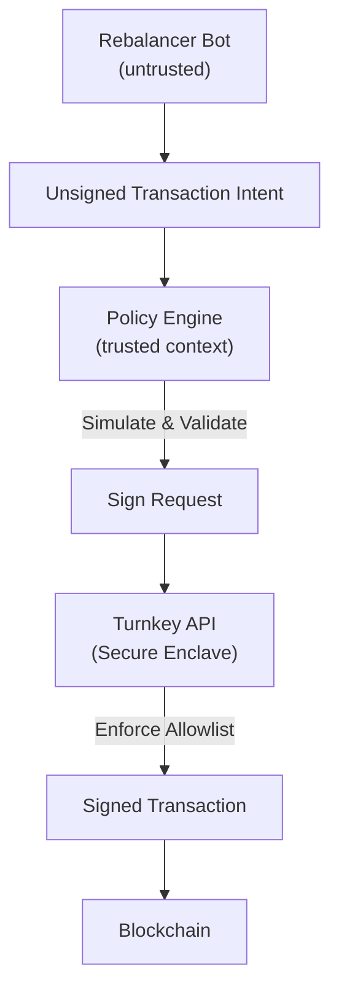

# 3. Policy-Gated Signer (Turnkey)

## Purpose

Enable **fully automated EVM operations** (rebalancing, market making, vault ops) using **Turnkey** as a programmable, non-custodial signing backend.

This design serves as a **modern, crypto-native alternative** to AWS KMS, offering native secp256k1 support, granular EVM policy enforcement, and auditability.

---

## Core Principle

> **The signer enforces the rules, the bot only proposes.**

Security is enforced by **multilayered policy**:
1.  **Dynamic Policy (Application Layer):** Business logic and simulation.
2.  **Static Policy (Enclave Layer):** Cryptographic hard rules enforced by Turnkey.

---

## Architecture Overview



---

## Components

### 1. Rebalancer Bot (Untrusted)

**Responsibilities**
*   Monitors chain state.
*   Calculates necessary actions (e.g., "Sell 10 ETH for USDC").
*   Constructs the unsigned transaction.

**Constraints**
*   Has **NO access** to private keys.
*   Has **NO access** to Turnkey API keys (cannot request signatures directly).

### 2. Policy Engine (Trusted Gateway)

**Responsibilities**
*   **Authentication:** Holds the Turnkey API Key (`Authenticator`) with signing permissions.
*   **Simulation:** Simulates the transaction (via Tenderly/Alchemy) to verify outcomes (e.g., "Balance change > X").
*   **Contextual Checks:** Checks things Turnkey cannot know (e.g., "Is the oracle price fresh?", "Is gas price reasonable?").

**Output**
*   If valid: Forwards the transaction to Turnkey for signing.
*   If invalid: Rejects the request.

### 3. Turnkey (Signer & Hard Policy)

**Responsibilities**
*   **Secure Storage:** Holds the private key in a generic TEE (Trusted Execution Environment).
*   **Hard Policy Enforcement:**
    *   Validates the **Requester** (must be the Policy Engine's API Key).
    *   Validates the **Transaction** structure (using `eth.tx` parser).
    *   Enforces **Allowlists** (e.g., "Destination must be Uniswap Router").

**Why Turnkey?**
*   **Native specific Policies:** Can parse EVM calldata inside the enclave.
*   **No "Low-S" Issues:** Natively supports Ethereum's secp256k1 requirements (unlike AWS KMS).
*   **Audit Logs:** Immutable logs of every signing attempt, useful for forensics.

---

## Turnkey Specifics

### Organization Structure

*   **Organization:** `Elitra Protocol`
*   **Wallet:** `Protocol Vaults` (HD Wallet)
*   **User:** `Policy Engine Service` (Machine User)
*   **Authenticator:** `API Key Pair` (held by the Policy Engine service)

### Policy Configuration (JSON)

Turnkey policies allow us to restrict *what* the Policy Engine can sign.

**Example: Whitelist Uniswap Router & Function Selector**

```json
{
  "policyName": "Allow Swap on Uniswap",
  "effect": "EFFECT_ALLOW",
  "consensus": "true",
  "condition": "api.key.name == 'Policy Engine Key' && wallet.name == 'Protocol Vaults' && eth.tx.to == '0xE592427A0AEce92De3Edee1F18E0157C05861564' && eth.tx.data.startsWith('0x414bf389')" 
}
```
*Note: `0x414bf389` is `exactInputSingle`.*

---


---

## Implementation Reference (TypeScript)

### Prerequisites

```bash
npm install @turnkey/api-key-stamper @turnkey/http @turnkey/viem viem
```

### 1. Bot -> Policy Engine

*Standard HTTP request with unsigned transaction.*

### 2. Policy Engine -> Turnkey

```typescript
import { TurnkeyClient } from "@turnkey/http";
import { ApiKeyStamper } from "@turnkey/api-key-stamper";
import { createAccount } from "@turnkey/viem";
import { createWalletClient, http } from "viem";
import { mainnet } from "viem/chains";

// 1. Setup Turnkey Client (Admin/Signer Context)
const stamper = new ApiKeyStamper({
  apiPublicKey: process.env.TURNKEY_API_PUBLIC_KEY!,
  apiPrivateKey: process.env.TURNKEY_API_PRIVATE_KEY!,
});

const client = new TurnkeyClient(
  { baseUrl: "https://api.turnkey.com" },
  stamper
);

// 2. Setup Viem Adapter
const turnkeyAccount = await createAccount({
  client,
  organizationId: process.env.TURNKEY_ORGANIZATION_ID!,
  signWith: process.env.TURNKEY_WALLET_ADDRESS!, // The address we want to use
});

const result = await turnkeyAccount.signTransaction({
    to: "0x...",
    value: 0n,
    data: "0x...",
    // ... other tx fields
});

// Broadcast `result` (which is the signed serialized tx)
```

### 3. Advanced: Dynamic Policy Enforced by Turnkey

To enforce the "Allowlist" policy shown above, you simply configure it in the Turnkey Dashboard or via the Terraform Provider. The code above *will fail* with a `403 Forbidden` if the transaction does not match the policy (e.g. wrong destination address), *even if* the API Key is valid.

---

## Security Guarantees

| Threat | Outcome |
| :--- | :--- |
| **Bot Compromised** | Can only request valid strategies. Invalid/Drain intents rejected by Policy Engine. |
| **Policy Engine Compromised** | Attacker has the API Key. **Turnkey Policy** still restricts them to *only* calling whitelisted contracts. They cannot drain funds to an arbitrary address. |
| **Turnkey Compromised** | Unlikely (TEE). Requires breaking secure enclave guarantees. |

## Recommendation

Use **Turnkey** for high-value automated systems where "Hash Signing" (AWS KMS) provides insufficient context. The ability to bake "Allow via Uniswap" directly into the key's usage policy removes the Policy Engine as a single point of failure for fund theft.


