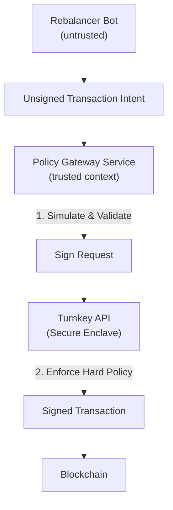

# 3. Policy-Gated Signer (Turnkey)

## Purpose

Enable **fully automated EVM operations** (rebalancing, market making, vault ops) using **Turnkey** as a programmable, non-custodial signing backend.

This design serves as a **modern, crypto-native alternative** to AWS KMS, offering native secp256k1 support, granular EVM policy enforcement, and auditability via immutable logs.

---

## Core Principle

> **The signer enforces the hard rules (security), the bot handles the soft rules (strategy).**

Security is enforced by a **multilayered policy**:
1.  **Application Policy (Simulation Layer):** Business logic, profitability checks, and outcome simulation (via Tenderly/Alchemy).
2.  **Turnkey Policy (Enclave Layer):** Cryptographic hard rules enforced by Turnkey's TEE (Trusted Execution Environment).

---

## Architecture Overview



---

## Components

### 1. Rebalancer Bot (Untrusted)

**Responsibilities**
*   Monitors chain state.
*   Calculates necessary actions (e.g., "Sell 10 ETH for USDC").
*   Constructs the unsigned transaction.

**Constraints**
*   Has **NO access** to private keys.
*   Has **NO access** to Turnkey API keys (cannot request signatures directly).

### 2. Policy Gateway Service (Trusted Middleware)

**Responsibilities**
*   **Authentication:** Holds the Turnkey API Credentials (`API Key`) with signing permissions.
*   **Simulation:** Simulates the transaction (via Tenderly/Alchemy) to verify outcomes (e.g., "Balance change > X", "No revert").
*   **Contextual Checks:** Verifies off-chain data (Oracle freshness, gas prices).

**Output**
*   If valid: Forwards the transaction to Turnkey for signing.
*   If invalid: Rejects the request.

### 3. Turnkey (Signer & Hard Policy)

**Responsibilities**
*   **Secure Storage:** Holds the private key in **QuorumOS** (AWS Nitro Enclaves). Keys are never exposed.
*   **Native Policy Enforcement:**
    *   Validates the **Requester** (must be the Policy Gateway's API Key).
    *   Validates the **Transaction** fields using CEL (Common Expression Language).
    *   Enforces **Allowlists** (e.g., "Must interact with Uniswap Router").

**Why Turnkey?**
*   **Granular EVM Policies:** Can parse `eth.tx.data` inside the enclave to restrict function selectors.
*   **No "Low-S" Issues:** Natively supports Ethereum's secp256k1 requirements.
*   **Audit Logs:** Immutable logs of every signing attempt.

---

## Turnkey Specifics

### Organization Structure

*   **Organization:** `Elitra Protocol`
*   **Wallet:** `Protocol Vaults` (HD Wallet)
*   **User:** `Policy Gateway` (Machine User with API Keys)
*   **Policy:** `Allow Uniswap Trading` (Attached to the User)

### Policy Configuration (JSON)

Turnkey policies using **CEL (Common Expression Language)** allow us to restrict *what* the Policy Gateway can sign.

**Example: Whitelist Uniswap Router & `exactInputSingle`**

```json
{
  "policyName": "Allow Swap on Uniswap",
  "effect": "EFFECT_ALLOW",
  "consensus": "true",
  "condition": "eth.tx.to == '0xE592427A0AEce92De3Edee1F18E0157C05861564' && eth.tx.data.startsWith('0x414bf389') && eth.tx.value == '0'" 
}
```
*Note: `0x414bf389` is the function selector for `exactInputSingle`.*

---

## Implementation Reference (TypeScript)

### Prerequisites

```bash
npm install @turnkey/sdk-server @turnkey/viem viem
```

### 1. Bot -> Policy Gateway

*Standard HTTP request with unsigned transaction params.*

### 2. Policy Gateway -> Turnkey

```typescript
import { Turnkey } from "@turnkey/sdk-server";
import { createAccount } from "@turnkey/viem";
import { createWalletClient, http } from "viem";
import { mainnet } from "viem/chains";

// 1. Setup Turnkey Client (Admin/Signer Context)
const turnkey = new Turnkey({
  apiBaseUrl: "https://api.turnkey.com",
  apiPublicKey: process.env.TURNKEY_API_PUBLIC_KEY!,
  apiPrivateKey: process.env.TURNKEY_API_PRIVATE_KEY!,
  defaultOrganizationId: process.env.TURNKEY_ORGANIZATION_ID!,
});

// 2. Setup Viem Account with Turnkey Signer
const turnkeyAccount = await createAccount({
  client: turnkey.apiClient(),
  organizationId: process.env.TURNKEY_ORGANIZATION_ID!,
  signWith: process.env.TURNKEY_WALLET_ADDRESS!, // The address to sign with
});

// 3. Create Viem Client
const walletClient = createWalletClient({
  account: turnkeyAccount,
  chain: mainnet,
  transport: http(),
});

// 4. Sign & Send Transaction
// The 'signTransaction' call will trigger Turnkey's policy engine.
const hash = await walletClient.sendTransaction({
  to: "0xE592427A0AEce92De3Edee1F18E0157C05861564", // Uniswap Router
  value: 0n,
  data: "0x414bf389...", // exactInputSingle...
});

console.log("Transaction sent:", hash);
```

### 3. Handling Policy Rejections

If the transaction violates the Turnkey policy (e.g., wrong destination or value), the `sendTransaction` call will throw a `403 Forbidden` error from the Turnkey API.

---

## Security Guarantees

| Threat | Outcome |
| :--- | :--- |
| **Bot Compromised** | Can only request valid strategies. Invalid/Drain intents rejected by Policy Gateway (Simulation). |
| **Policy Gateway Compromised** | Attacker has the API Key. **Turnkey Policy** restricts them to *only* calling whitelisted contracts/functions. They cannot drain funds to an arbitrary address. |
| **Turnkey Compromised** | Extremely unlikely. Requires breaking AWS Nitro Enclaves (QuorumOS). |

## Recommendation

Use **Turnkey** for high-value automated systems where "Hash Signing" (AWS KMS) provides insufficient context. The ability to bake "Allow via Uniswap" directly into the key's usage policy removes the Policy Gateway as a single point of failure for fund theft.
