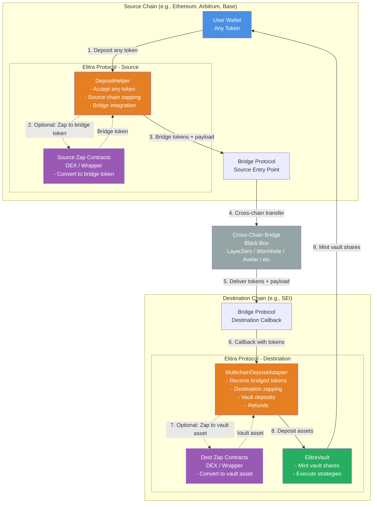
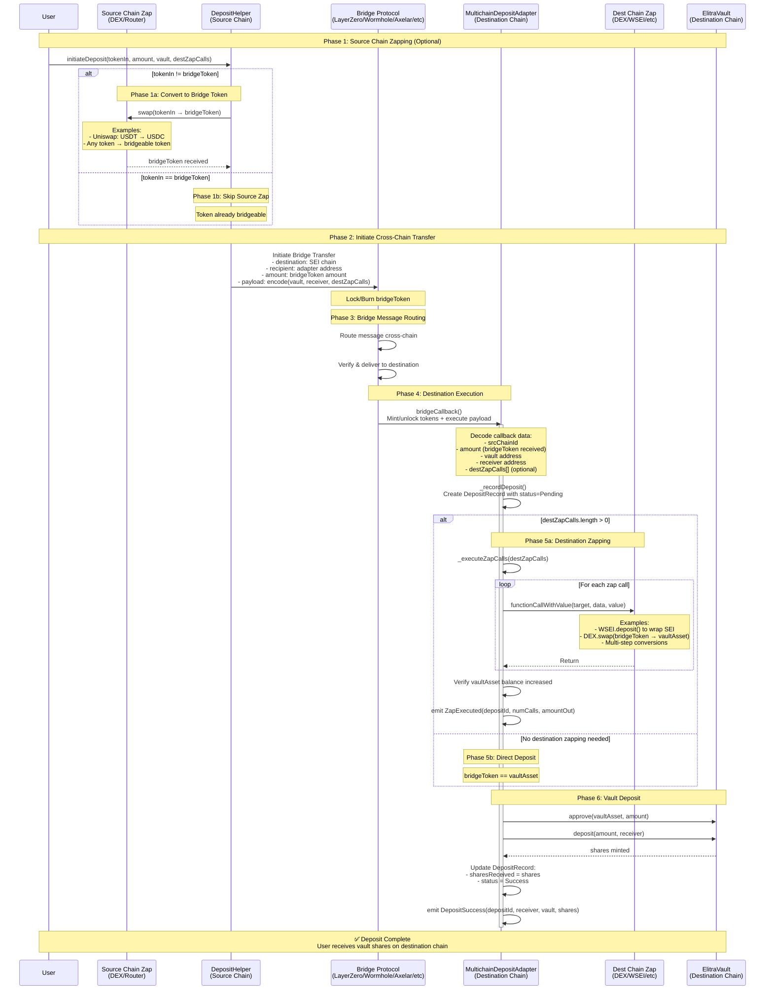
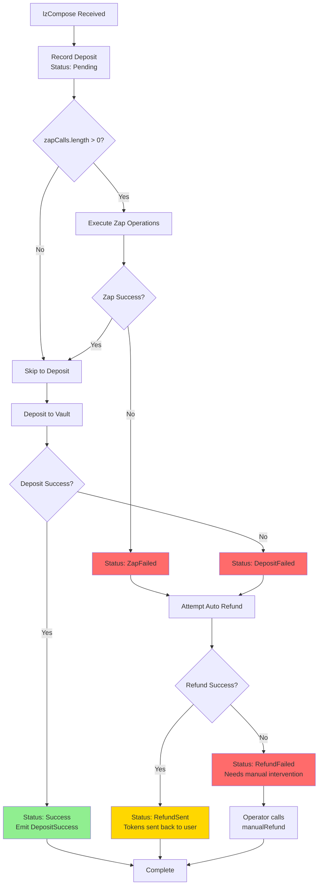

# Multichain Deposit Flow

This document explains the cross-chain deposit flow for Elitra vaults using any bridge protocol.

## Overview

The multichain deposit system allows users to deposit assets from any supported chain into Elitra vaults on the
destination chain (e.g., SEI). The system supports:

- **Protocol-agnostic architecture**: Works with any bridge protocol (LayerZero, CCTP, Axelar, etc.)
- **Deposit with any token**: Users can deposit any token on source chain, not just bridgeable tokens
- **Two-stage zapping**:
  - **Source chain**: Convert user's token → bridgeable token (e.g., USDT → USDC)
  - **Destination chain**: Convert bridged token → vault asset (e.g., USDC → WSEI)
- **Unified interface**: Same adapter can integrate with multiple bridge protocols
- **Single transaction UX**: Users initiate one transaction, receive vault shares on destination

## Components



## Architecture Flow



## Token Flow Overview

The complete token flow with two-stage zapping:

```
┌─────────────────────────────────────────────────────────────────────────┐
│                          SOURCE CHAIN (e.g., Ethereum)                  │
├─────────────────────────────────────────────────────────────────────────┤
│                                                                         │
│  User Token (e.g., DAI)                                                │
│         │                                                               │
│         │ [1] User calls DepositHelper.initiateDeposit()               │
│         │                                                               │
│         ▼                                                               │
│  ┌──────────────┐                                                       │
│  │ DepositHelper│                                                       │
│  └──────┬───────┘                                                       │
│         │                                                               │
│         │ [2] Execute sourceZapCalls (if needed)                       │
│         │     e.g., Uniswap.swap(DAI → USDC)                           │
│         │                                                               │
│         ▼                                                               │
│  Bridge Token (e.g., USDC)                                             │
│         │                                                               │
│         │ [3] Bridge tokens with payload                               │
│         │                                                               │
└─────────┼─────────────────────────────────────────────────────────────┘
          │
          │ [4] Cross-chain bridge transfer
          │     (LayerZero/Wormhole/Axelar/etc)
          │
┌─────────▼─────────────────────────────────────────────────────────────┐
│                     DESTINATION CHAIN (e.g., SEI)                       │
├─────────────────────────────────────────────────────────────────────────┤
│                                                                         │
│  Bridge Token (e.g., USDC)                                             │
│         │                                                               │
│         │ [5] Bridge calls adapter callback                            │
│         │                                                               │
│         ▼                                                               │
│  ┌──────────────────────────┐                                          │
│  │ MultichainDepositAdapter │                                          │
│  └──────┬───────────────────┘                                          │
│         │                                                               │
│         │ [6] Execute destZapCalls (if needed)                         │
│         │     e.g., SEI_DEX.swap(USDC → WSEI)                          │
│         │                                                               │
│         ▼                                                               │
│  Vault Asset (e.g., WSEI)                                              │
│         │                                                               │
│         │ [7] Deposit into vault                                       │
│         │                                                               │
│         ▼                                                               │
│  ┌──────────────┐                                                       │
│  │ ElitraVault  │                                                       │
│  └──────┬───────┘                                                       │
│         │                                                               │
│         │ [8] Mint vault shares                                        │
│         │                                                               │
│         ▼                                                               │
│  User receives vault shares on SEI                                     │
│                                                                         │
└─────────────────────────────────────────────────────────────────────────┘
```

**Key Points:**

- Users can deposit **any token** on the source chain
- Source chain converts user token → bridgeable token (e.g., DAI → USDC)
- Bridge transfers the bridgeable token cross-chain
- Destination chain converts bridged token → vault asset (e.g., USDC → WSEI)
- User receives vault shares on destination in a single transaction

## Detailed Component Breakdown

### 1. User Initiation & Source Chain Zapping (Source Chain)

Users can deposit with **any token** on the source chain. A `DepositHelper` contract handles optional source-side
zapping to convert the user's token into a bridgeable token.

**Two-Stage Zapping Architecture:**

```
User Token (Source) → [Source Zap] → Bridge Token → [Bridge] → Bridge Token (Dest) → [Dest Zap] → Vault Asset → [Vault]
```

**Example Flow:**

- User has USDT on Ethereum
- Source Zap: USDT → USDC (via Uniswap)
- Bridge: USDC (Ethereum) → USDC (SEI)
- Dest Zap: USDC → WSEI (via SEI DEX)
- Vault: Deposit WSEI

**DepositHelper Contract (Source Chain):**

```solidity
contract DepositHelper {
    /// @notice Initiate cross-chain deposit with any token
    /// @param tokenIn Token user wants to deposit
    /// @param amountIn Amount of tokenIn
    /// @param bridgeToken Token that can be bridged (e.g., USDC)
    /// @param sourceZapCalls Optional: Convert tokenIn → bridgeToken
    /// @param vault Target vault on destination chain
    /// @param receiver Who receives vault shares
    /// @param destZapCalls Optional: Convert bridgeToken → vaultAsset on destination
    function initiateDeposit(
        address tokenIn,
        uint256 amountIn,
        address bridgeToken,
        Call[] memory sourceZapCalls,
        address vault,
        address receiver,
        Call[] memory destZapCalls
    ) external payable {
        // Pull user's tokens
        IERC20(tokenIn).transferFrom(msg.sender, address(this), amountIn);

        uint256 bridgeAmount = amountIn;

        // Execute source zap if needed
        if (sourceZapCalls.length > 0) {
            bridgeAmount = _executeSourceZap(
                tokenIn,
                amountIn,
                bridgeToken,
                sourceZapCalls
            );
        }

        // Build destination payload
        bytes memory payload = abi.encode(vault, receiver, destZapCalls);

        // Bridge tokens with payload
        _bridgeTokens(bridgeToken, bridgeAmount, payload);
    }

    function _executeSourceZap(
        address tokenIn,
        uint256 amountIn,
        address bridgeToken,
        Call[] memory zapCalls
    ) internal returns (uint256 bridgeAmount) {
        uint256 balanceBefore = IERC20(bridgeToken).balanceOf(address(this));

        // Execute each zap call
        for (uint256 i = 0; i < zapCalls.length; i++) {
            (bool success, ) = zapCalls[i].target.call{value: zapCalls[i].value}(
                zapCalls[i].data
            );
            require(success, "Source zap failed");
        }

        uint256 balanceAfter = IERC20(bridgeToken).balanceOf(address(this));
        bridgeAmount = balanceAfter - balanceBefore;
        require(bridgeAmount > 0, "No bridge tokens received");
    }

    function _bridgeTokens(
        address bridgeToken,
        uint256 amount,
        bytes memory payload
    ) internal {
        // Bridge-specific implementation
        // See examples below
    }
}
```

**Example: LayerZero Implementation**

```solidity
function _bridgeTokens(
    address bridgeToken,
    uint256 amount,
    bytes memory payload
) internal {
    SendParam memory sendParam = SendParam({
        dstEid: destinationChainId,
        to: bytes32(uint256(uint160(adapterAddress))),
        amountLD: amount,
        minAmountLD: amountWithSlippage,
        extraOptions: executionOptions,
        composeMsg: payload,
        oftCmd: ""
    });

    IOFT(bridgeToken).send{value: msg.value}(sendParam, fee, msg.sender);
}
```

**Example: Wormhole Implementation**

```solidity
function _bridgeTokens(
    address bridgeToken,
    uint256 amount,
    bytes memory payload
) internal {
    IERC20(bridgeToken).approve(address(tokenBridge), amount);

    TokenBridge.transferTokensWithPayload{value: msg.value}(
        bridgeToken,
        amount,
        targetChain,
        adapterAddress,
        0,
        payload
    );
}
```

### 2. Bridge Message Processing

The bridge protocol handles cross-chain message routing using its own security and verification model:

- **Lock/Burn Phase**: Source chain locks or burns tokens
- **Message Routing**: Bridge validators/relayers verify and route the message
- **Delivery**: Destination chain receives verified message and mints/unlocks tokens

### 3. Adapter Callback

The adapter implements bridge-specific callback interfaces to receive tokens and execute the deposit flow:

**Generic Callback Pattern:**

```solidity
// Adapter implements bridge-specific receiver interface
// Each bridge calls different callback functions:

// LayerZero: IOAppComposer.lzCompose()
// Wormhole: IWormholeReceiver.receiveWormholeMessages()
// Axelar: IAxelarExecutable.execute()

function bridgeCallback(
    uint256 srcChainId,
    address srcSender,
    uint256 amount,
    bytes calldata payload
) external {
    // Decode standardized payload
    (address vault, address receiver, Call[] memory zapCalls) =
        abi.decode(payload, (address, address, Call[]));

    // Process the deposit...
}
```

### 4. Zapping Operations

Zapping can occur on both source and destination chains, enabling users to deposit with any token on the source chain
and end up with vault shares on the destination chain.

#### Source Chain Zapping (DepositHelper)

Converts user's token → bridgeable token before bridging:

**Example 1: USDT → USDC on Ethereum**

```solidity
// User wants to deposit USDT, but only USDC is bridgeable
sourceZapCalls[0] = Call({
    target: UNISWAP_ROUTER,
    value: 0,
    data: abi.encodeCall(
        router.swapExactTokensForTokens,
        (usdtAmount, minUsdcOut, path, address(this), deadline)
    )
});
```

**Example 2: ETH → Bridgeable WETH**

```solidity
// User deposits native ETH, wrap to WETH for bridging
sourceZapCalls[0] = Call({
    target: WETH_ADDRESS,
    value: ethAmount,
    data: abi.encodeWithSignature("deposit()")
});
```

**Example 3: Multi-step Source Conversion**

```solidity
sourceZapCalls[0] = Call({ /* Approve token for DEX */ });
sourceZapCalls[1] = Call({ /* Swap tokenA → tokenB */ });
sourceZapCalls[2] = Call({ /* Swap tokenB → bridgeToken */ });
```

#### Destination Chain Zapping (MultichainDepositAdapter)

Converts bridged token → vault asset on destination:

**Example 1: Wrap Native SEI to WSEI**

```solidity
destZapCalls[0] = Call({
    target: WSEI_ADDRESS,
    value: amount,
    data: abi.encodeWithSignature("deposit()")
});
```

**Example 2: Swap USDC → WSEI via DEX**

```solidity
destZapCalls[0] = Call({
    target: SEI_DEX_ROUTER,
    value: 0,
    data: abi.encodeCall(
        router.swap,
        (USDC, WSEI, amount, minOut, deadline)
    )
});
```

**Example 3: Multi-step Destination Conversion**

```solidity
destZapCalls[0] = Call({ /* Approve bridged token for DEX */ });
destZapCalls[1] = Call({ /* Swap bridgeToken → intermediateToken */ });
destZapCalls[2] = Call({ /* Swap intermediateToken → vaultAsset */ });
```

#### Complete Two-Stage Zap Example

**Scenario:** User on Ethereum wants to deposit DAI into WSEI vault on SEI

```solidity
// On Ethereum (Source):
// sourceZapCalls: DAI → USDC (Uniswap)
sourceZapCalls[0] = Call({
    target: UNISWAP_ROUTER,
    value: 0,
    data: encodeSwap(DAI, USDC, daiAmount)
});

// Bridge: USDC (Ethereum) → USDC (SEI)

// On SEI (Destination):
// destZapCalls: USDC → WSEI (SEI DEX)
destZapCalls[0] = Call({
    target: SEI_DEX,
    value: 0,
    data: encodeSwap(USDC, WSEI, usdcAmount)
});

// Final: User receives WSEI vault shares on SEI
```

### 5. Vault Deposit

After zapping (or directly if no zap needed), deposit into the vault:

```solidity
function _depositToVault(
    address vault,
    address receiver,
    uint256 amount
) internal returns (uint256 shares) {
    address asset = IElitraVault(vault).asset();

    // Approve vault
    IERC20(asset).forceApprove(vault, amount);

    // Deposit and mint shares to receiver
    shares = IElitraVault(vault).deposit(amount, receiver);
}
```

## Error Handling & Refunds



### Automatic Refund System

If any step fails, the adapter attempts to refund tokens to the user via the same bridge protocol:

```solidity
function _attemptRefund(uint256 depositId) internal {
    DepositRecord storage record = depositRecords[depositId];

    // Bridge-specific refund logic
    // The adapter uses the same bridge protocol that delivered the tokens
    // to send them back to the source chain

    if (record.bridgeProtocol == BridgeProtocol.LayerZero) {
        _refundViaLayerZero(record);
    } else if (record.bridgeProtocol == BridgeProtocol.Wormhole) {
        _refundViaWormhole(record);
    } else if (record.bridgeProtocol == BridgeProtocol.Axelar) {
        _refundViaAxelar(record);
    }
    // ... other bridge protocols
}

// Example: LayerZero refund
function _refundViaLayerZero(DepositRecord memory record) internal {
    SendParam memory sendParam = SendParam({
        dstEid: record.srcChainId,
        to: bytes32(uint256(uint160(record.user))),
        amountLD: record.amountIn,
        minAmountLD: amountWithSlippage,
        extraOptions: "",
        composeMsg: "",
        oftCmd: ""
    });

    IOFT(oft).send{value: fee}(sendParam, fee, payable(this));
}
```

## Deposit Record Tracking

Every deposit is tracked with a complete audit trail:

```solidity
struct DepositRecord {
    address user;              // Share receiver
    uint256 srcChainId;       // Source chain ID (standardized across all bridges)
    address tokenIn;          // Received token
    uint256 amountIn;         // Received amount
    address vault;            // Target vault
    uint256 sharesReceived;   // Vault shares (0 if failed)
    uint256 timestamp;        // Deposit time
    DepositStatus status;     // Current status
    BridgeProtocol bridge;    // Which bridge was used (LayerZero, Wormhole, etc.)
    bytes32 messageId;        // Bridge-specific message identifier
    bytes failureReason;      // Error data if failed
}
```

### Status Flow

```
Pending → Success                    (Happy path)
Pending → ZapFailed → RefundSent     (Zap fails, refund succeeds)
Pending → ZapFailed → RefundFailed   (Zap fails, refund fails - needs manual)
Pending → DepositFailed → RefundSent (Deposit fails, refund succeeds)
```

## Gas Considerations

Different bridge protocols have different approaches to gas management for destination execution:

### Gas Estimation by Protocol

**LayerZero**: Requires explicit gas limits for receive and compose operations

```solidity
bytes memory lzReceiveOption = abi.encodePacked(
    uint128(200000),  // gas for token minting
    uint128(0)        // msg.value
);

bytes memory lzComposeOption = abi.encodePacked(
    uint16(0),         // index
    uint128(1200000),  // gas for zap + deposit (adjust based on complexity)
    uint128(0)         // msg.value
);
```

**Wormhole**: Gas is paid on destination by relayers, can specify delivery provider and gas budget

```solidity
// Gas budget specified in relayer fee quote
uint256 gasLimit = 500000; // Adjust based on zap complexity
```

**Axelar**: Uses automatic gas estimation or manual gas service payment

```solidity
// Gas is handled by Axelar Gas Service on source chain
gasService.payNativeGasForContractCall{value: gasPayment}(
    sender,
    destinationChain,
    destinationAddress,
    payload,
    refundAddress
);
```

### Estimated Gas Usage

- **Token minting/unlock**: ~100,000 - 200,000 gas
- **Simple deposit (no zap)**: ~150,000 - 200,000 gas
- **With zap (1-2 operations)**: ~400,000 - 800,000 gas
- **Complex multi-step zap**: ~800,000 - 1,500,000 gas

## Adapter Architecture Patterns

The MultichainDepositAdapter can be implemented using different architectural approaches:

### Pattern 1: Monolithic Adapter (Single Contract)

The adapter directly implements all bridge receiver interfaces:

```solidity
contract MultichainDepositAdapter is
    IOAppComposer,           // LayerZero
    IWormholeReceiver,       // Wormhole
    IAxelarExecutable,       // Axelar
    IMessageRecipient        // Hyperlane
{
    // Unified internal deposit logic
    function _processDeposit(
        uint256 srcChainId,
        address user,
        uint256 amount,
        bytes memory payload
    ) internal { ... }

    // Bridge-specific entry points all call _processDeposit
    function lzCompose(...) external { ... _processDeposit(...) }
    function receiveWormholeMessages(...) external { ... _processDeposit(...) }
    function execute(...) external { ... _processDeposit(...) }
}
```

**Pros**: Simple deployment, single contract to manage, lower gas costs **Cons**: Large contract size, harder to upgrade
individual bridge integrations

### Pattern 2: Bridge Adapter Pattern (Multiple Contracts)

Separate adapter contracts for each bridge, all forwarding to a core deposit processor:

```solidity
contract CoreDepositProcessor {
    function processDeposit(
        uint256 srcChainId,
        address user,
        uint256 amount,
        bytes calldata payload
    ) external onlyBridgeAdapter { ... }
}

contract LayerZeroAdapter is IOAppComposer {
    CoreDepositProcessor public processor;
    function lzCompose(...) external {
        processor.processDeposit(srcChainId, user, amount, payload);
    }
}

contract WormholeAdapter is IWormholeReceiver {
    CoreDepositProcessor public processor;
    function receiveWormholeMessages(...) external {
        processor.processDeposit(srcChainId, user, amount, payload);
    }
}
```

**Pros**: Modular, easy to add new bridges, isolated upgrades **Cons**: More deployment complexity, slightly higher gas
costs

### Pattern 3: Hybrid (Recommended)

Core adapter implements most common bridges, with plugin system for new bridges:

```solidity
contract MultichainDepositAdapter is IOAppComposer {
    mapping(address => bool) public bridgePlugins;

    // Native support for common bridges
    function lzCompose(...) external { ... }

    // Generic entry point for plugin bridges
    function processBridgeDeposit(
        uint256 srcChainId,
        address user,
        uint256 amount,
        bytes calldata payload
    ) external onlyBridgePlugin { ... }
}
```

**Pros**: Balance of simplicity and extensibility **Cons**: Need to maintain plugin authorization

## Security Features

1. **Pausable**: Admin can pause all operations
2. **Reentrancy Protection**: All external calls protected
3. **Vault Whitelisting**: Only approved vaults can be targeted
4. **Bridge Whitelisting**: Only approved bridge contracts can call adapter
5. **Access Control**: Owner + Operator roles
6. **Automatic Refunds**: Failed operations trigger refunds via same bridge
7. **Manual Recovery**: Operators can manually refund stuck deposits
8. **Emergency Recovery**: Owner can recover stuck tokens
9. **Bridge Isolation**: Failures in one bridge don't affect others

### Supported Bridge Protocols

The adapter can integrate with any bridge protocol by implementing the appropriate receiver interface:

| Bridge Protocol | Receiver Interface  | Callback Function                   | Token Transfer Model           |
| --------------- | ------------------- | ----------------------------------- | ------------------------------ |
| **LayerZero**   | `IOAppComposer`     | `lzCompose()`                       | OFT (Omnichain Fungible Token) |
| **Wormhole**    | `IWormholeReceiver` | `receiveWormholeMessages()`         | Token Bridge with payload      |
| **Axelar**      | `IAxelarExecutable` | `execute()` or `executeWithToken()` | General Message Passing (GMP)  |
| **Hyperlane**   | `IMessageRecipient` | `handle()`                          | Warp Routes                    |
| **Synapse**     | Custom              | `executeTransaction()`              | Bridge with message            |
| **Any Bridge**  | Custom Interface    | Bridge-specific callback            | Protocol-defined model         |

### Generic Data Flow

Regardless of the bridge protocol, the flow follows this standardized pattern:

| Step | Component                | Action              | Protocol-Agnostic Data                                                              |
| ---- | ------------------------ | ------------------- | ----------------------------------------------------------------------------------- |
| 1    | User → Bridge            | Initiate transfer   | `amount`, `destChain`, `recipient: adapter`, `payload: (vault, receiver, zapCalls)` |
| 2    | Bridge Source            | Lock/burn tokens    | Token supply adjusted on source chain                                               |
| 3    | Bridge Infrastructure    | Cross-chain routing | Message verification and delivery via bridge validators                             |
| 4    | Bridge Dest → Adapter    | Mint/unlock tokens  | Tokens transferred to adapter contract                                              |
| 5    | Bridge Dest → Adapter    | Execute callback    | `srcChain`, `amount`, `payload` decoded from message                                |
| 6    | Adapter                  | Record deposit      | Create `DepositRecord` with `Pending` status                                        |
| 7    | Adapter → Zap (optional) | Convert tokens      | Execute `zapCalls[]` to convert to vault asset                                      |
| 8    | Adapter → Vault          | Deposit assets      | `vault.deposit(amount, receiver)`                                                   |
| 9    | Vault → User             | Mint shares         | User receives vault shares on destination chain                                     |
