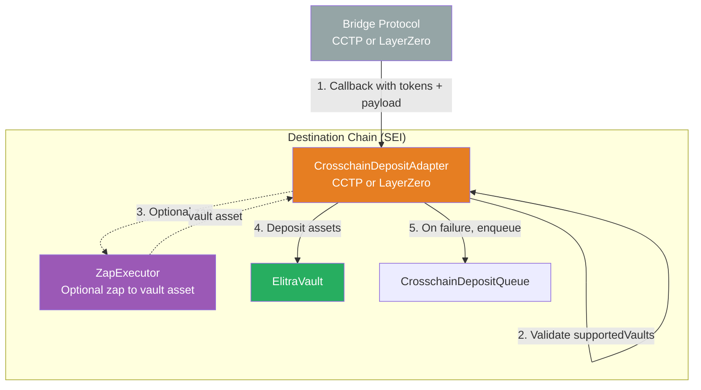
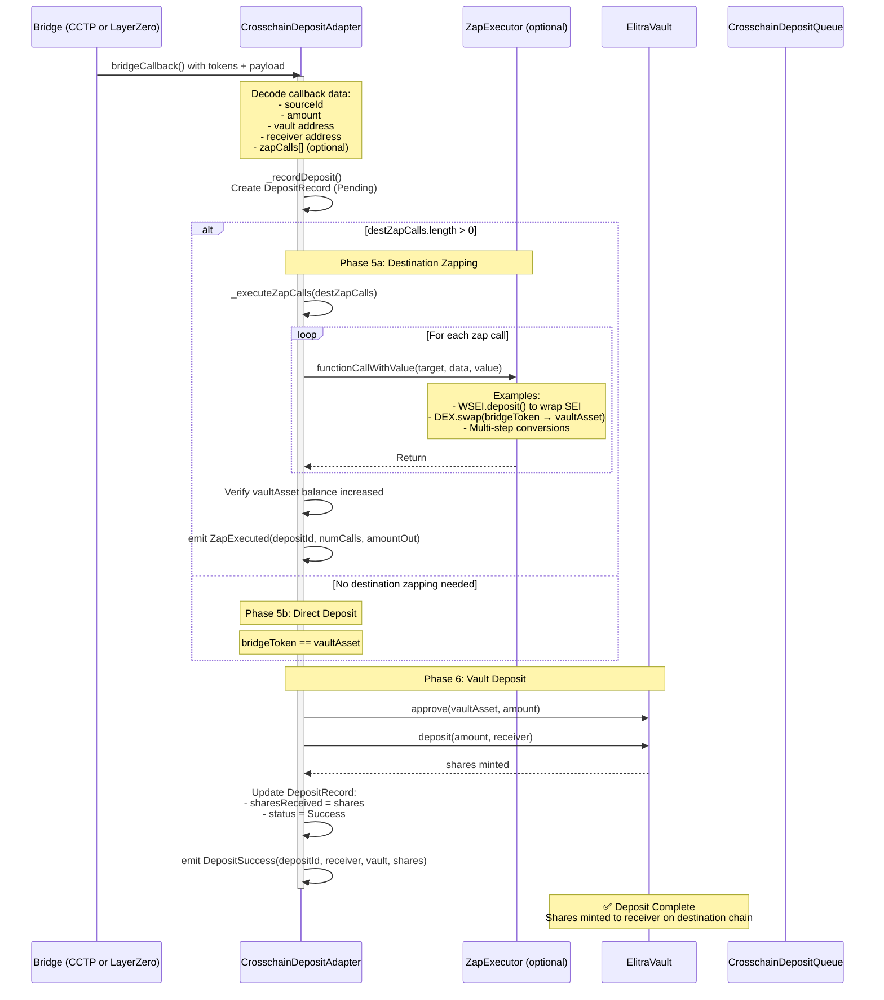

# Cross-Chain Deposit Flow (CCTP + LayerZero)

This document explains the cross-chain deposit flow for Elitra vaults using **CCTP** and **LayerZero** only.

## Overview

The cross-chain deposit system allows users to deposit assets into Elitra vaults on the destination chain (SEI) via
**CCTP** or **LayerZero**. The system supports:

- **Bridge-specific adapters**: `CCTP` and `LayerZero` adapters only.
- **Destination-chain zapping**: optional zap into the vault asset via `ZapExecutor`.
- **Vault allowlist**: only `supportedVaults` can receive deposits.
- **Failure queue**: failed deposits can be recorded and resolved via `CrosschainDepositQueue`.

## Current Implementation (Aligned to Code)

The current codebase implements **destination-chain adapters only**:

- `CCTP` and `LayerZero` adapters inherit `BaseCrosschainDepositAdapter`.
- Adapters enforce a `supportedVaults` allowlist before depositing.
- Destination zaps are executed via `ZapExecutor` with `minAmountOut` slippage protection.
- `Api3SwapAdapter` is available as a SEI swap adapter for zap call payloads.
- Failed deposits can be recorded and resolved via `CrosschainDepositQueue`.

There is **no source-chain DepositHelper** and **no source-side zapping** in this repo.

## Components (Current)

```mermaid
graph TB
    Bridge[Bridge Protocol<br/>CCTP or LayerZero]

    subgraph "Destination Chain (SEI)"
        Adapter[CrosschainDepositAdapter<br/>CCTP or LayerZero]
        DestZap[ZapExecutor<br/>Optional zap to vault asset]
        Vault[ElitraVault]
        Queue[CrosschainDepositQueue]
    end

    Bridge -->|"1. Callback with tokens + payload"| Adapter
    Adapter -->|"2. Validate supportedVaults"| Adapter
    Adapter -.->|"3. Optional zap"| DestZap
    DestZap -.->|"vault asset"| Adapter
    Adapter -->|"4. Deposit assets"| Vault
    Adapter -->|"5. On failure, enqueue"| Queue

    style Adapter fill:#E67E22,color:#fff
    style Vault fill:#27AE60,color:#fff
    style DestZap fill:#9B59B6,color:#fff
    style Bridge fill:#95A5A6,color:#fff
```

## Architecture Flow (Current)

```mermaid
sequenceDiagram
    participant Bridge as Bridge (CCTP or LayerZero)
    participant Adapter as CrosschainDepositAdapter
    participant DestZap as ZapExecutor (optional)
    participant Vault as ElitraVault
    participant Queue as CrosschainDepositQueue

    Bridge->>Adapter: bridgeCallback() with tokens + payload

    activate Adapter
    Note over Adapter: Decode callback data:<br/>- sourceId<br/>- amount<br/>- vault address<br/>- receiver address<br/>- zapCalls[] (optional)

    Adapter->>Adapter: _recordDeposit()<br/>Create DepositRecord (Pending)

    alt destZapCalls.length > 0
        Note over Adapter,DestZap: Phase 5a: Destination Zapping
        Adapter->>Adapter: _executeZapCalls(destZapCalls)

        loop For each zap call
            Adapter->>DestZap: functionCallWithValue(target, data, value)
            Note over DestZap: Examples:<br/>- WSEI.deposit() to wrap SEI<br/>- DEX.swap(bridgeToken → vaultAsset)<br/>- Multi-step conversions
            DestZap-->>Adapter: Return
        end

        Adapter->>Adapter: Verify vaultAsset balance increased
        Adapter->>Adapter: emit ZapExecuted(depositId, numCalls, amountOut)
    else No destination zapping needed
        Note over Adapter: Phase 5b: Direct Deposit
        Note over Adapter: bridgeToken == vaultAsset
    end

    Note over Adapter,Vault: Phase 6: Vault Deposit
    Adapter->>Vault: approve(vaultAsset, amount)
    Adapter->>Vault: deposit(amount, receiver)
    Vault-->>Adapter: shares minted

    Adapter->>Adapter: Update DepositRecord:<br/>- sharesReceived = shares<br/>- status = Success
    Adapter->>Adapter: emit DepositSuccess(depositId, receiver, vault, shares)

    deactivate Adapter

    Note over Vault: ✅ Deposit Complete<br/>Shares minted to receiver on destination chain
```

## Out of Scope

Source-chain helpers, source-side zapping, and bridges other than **CCTP** and **LayerZero** are intentionally omitted
from this spec because they are not implemented in the current repo.
