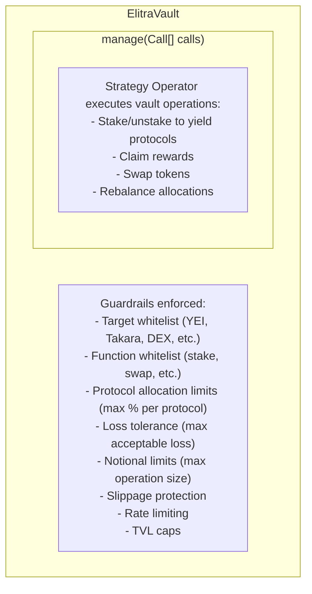
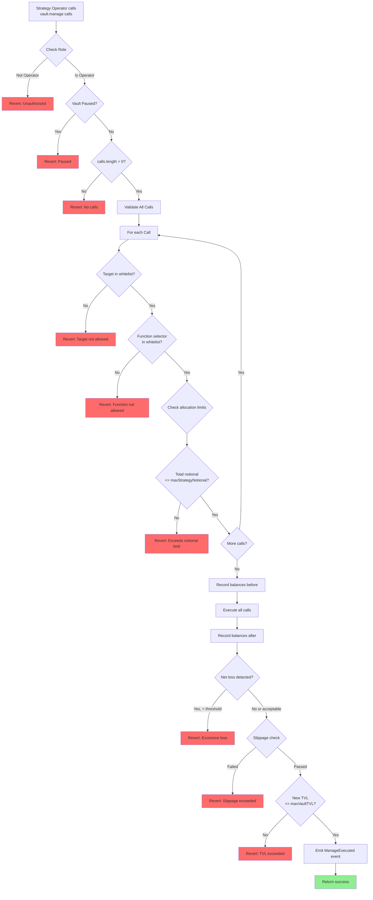

## Elitra Guardrails Specification

### Scope

This document specifies the **on-chain guardrails and risk limits** for the Elitra protocol. It complements
`crosschain.md` by defining how vaults, adapters, and operators are constrained, with strategy logic assumed to live
**off-chain**.

The primary goals are:

- **Protect LPs** from unbounded or unexpected behavior.
- **Constrain off-chain strategies** via hard on-chain limits.
- **Provide auditability** through explicit state and events.

The design is inspired by patterns from **Mellow Vaults** (vault vs strategy separation, risk limits, role-based
permissions) but adapted to Elitra's **cross-chain, bridge-agnostic** architecture.

### Guardrails in the Current System

The current Elitra system focuses guardrails primarily on **vault strategy operations**:



**Primary Focus: Vault Strategy Operations via manage()**

The `manage()` function is the most powerful operation in the vault, allowing strategy operators to execute arbitrary
operations with vault assets. All guardrails are designed to constrain this function while maintaining flexibility for
off-chain strategy logic.

_Note: Cross-chain deposit guardrails (DepositHelper, MultichainAdapter) will be added in a future iteration._

---

## Design Principles

### P1. Vaults as Accounting + Risk Shell

- `ElitraVault` is responsible for:
  - ERC-4626 accounting (assets, shares, conversions).
  - Enforcing **vault-level limits** on deposits/withdrawals.
  - Exposing state needed for risk monitoring.
- It is **not** responsible for complex strategy logic; that is driven off-chain and executed via controlled on-chain
  entry points (e.g., zaps, rebalances).

### P2. Off-Chain Strategies, On-Chain Guardrails

- Strategy logic (when to rebalance, what routes to use, which DEX/protocol) is off-chain.
- Contracts act as a **risk engine**:
  - Enforce caps, whitelists, and slippage bounds.
  - Reject any transaction that violates configured constraints, regardless of who submits it.

### P3. Explicit Roles & Separation of Duties

- LPs, strategy operators, governance, and guardians have distinct allowed operations.
- Sensitive configuration changes and emergency actions are gated behind roles.

### P4. Auditability & Observability

- Guardrails are reflected in on-chain storage (config structs) and events.
- Every significant operation (zap, deposit, config change, refund, rebalance) emits structured events.

---

## Core Concepts

### 1. Vault-Level Risk Configuration

Each `ElitraVault` is associated with a **vault-level risk configuration** that governs how much value it can hold and
how flows are bounded.

#### 1.1. Example RiskConfig Struct

```solidity
struct VaultRiskConfig {
    // TVL limits
    uint256 maxVaultTVL;         // Maximum total assets managed by this vault

    // Flow limits (per operation)
    uint256 maxSingleDeposit;    // Maximum assets per deposit
    uint256 maxSingleWithdraw;   // Maximum assets per withdrawal

    // Optional: time-based throttling
    uint64 minSecondsBetweenLargeFlows; // Rate limit for large ops
    uint256 largeFlowThreshold;         // Definition of "large" (in asset units)
}
```

> **Note:** The exact fields can evolve. The important part is that limits are explicitly stored and updated through
> governance-controlled functions.

#### 1.2. Invariants

For any vault:

- \( \text{totalAssets} \leq \text{maxVaultTVL} \) if `maxVaultTVL > 0`.
- A deposit must satisfy \( \text{amount} \leq \text{maxSingleDeposit} \) if set.
- A withdrawal must satisfy \( \text{amount} \leq \text{maxSingleWithdraw} \) if set.
- Large flows (as defined by `largeFlowThreshold`) must be spaced by at least `minSecondsBetweenLargeFlows` when
  configured.

---

### 2. Strategy Guardrails via manage()

The `manage()` function is the core operation that needs comprehensive guardrails. It uses **generic call sequences**
(`Call[]`) to execute strategy operations with vault assets.

#### 2.1. Call Type

A generic call is:

```solidity
struct Call {
    address target;
    uint256 value;
    bytes data;
}
```

This flexible structure allows strategy operators to interact with any protocol, but is tightly constrained by
guardrails.

#### 2.2. StrategyRiskConfig

```solidity
struct StrategyRiskConfig {
    // Notional limits
    uint256 maxStrategyNotional;        // Max total value in single manage() call

    // Per-protocol allocation limits (as basis points of TVL)
    mapping(address => uint16) maxProtocolAllocationBps;  // e.g., 5000 = 50% max in one protocol

    // Loss tolerance (basis points)
    uint16 maxAcceptableLossBps;        // e.g., 50 = 0.5% acceptable loss per operation

    // Slippage control
    uint16 maxStrategySlippageBps;      // e.g., 100 = 1% max slippage

    // Time-based throttling
    uint64 minSecondsBetweenManage;     // Min time between manage() calls
    uint64 minSecondsBetweenLargeManage; // For operations > largeManageThreshold
    uint256 largeManageThreshold;       // Definition of "large" operation
}
```

#### 2.3. Whitelisted Targets & Functions

To prevent arbitrary external calls, the vault maintains **two-layer whitelisting**:

**Target Whitelist:**

```solidity
// Target contracts (protocols)
mapping(address => bool) public isAllowedStrategyTarget;
```

Typical whitelisted targets:

- Yield protocols (e.g., YEI Protocol, Takara Protocol, Nectra)
- DEX routers (e.g., SEI DEX, Uniswap-like DEXs)
- Token wrappers (e.g., WSEI)

**Function Selector Whitelist:**

```solidity
// Target + function selector (first 4 bytes of calldata)
mapping(address => mapping(bytes4 => bool)) public isAllowedStrategyFunction;
```

Examples of allowed functions:

- YEI Protocol: `stake(uint256)`, `unstake(uint256)`, `claim()`
- Takara Protocol: `deposit(uint256)`, `withdraw(uint256)`
- DEX: `swap(...)`, `addLiquidity(...)`, `removeLiquidity(...)`

Examples of **NOT** allowed functions:

- `transferOwnership(address)` - Security risk
- `selfdestruct()` - Security risk
- `delegatecall(...)` - Security risk
- Any governance or admin functions

**Validation:**

```solidity
function _validateStrategyCall(Call memory call) internal view {
    // Check target whitelist
    require(isAllowedStrategyTarget[call.target], "Strategy target not allowed");

    // Check function selector whitelist (first 4 bytes of data)
    bytes4 selector = bytes4(call.data);
    require(
        isAllowedStrategyFunction[call.target][selector],
        "Strategy function not allowed"
    );
}
```

---

### 3. Roles & Permissions

Elitra leverages an existing roles/authority framework to enforce **separation of duties**. Core roles in the context of
guardrails:

#### 3.1. LP (Liquidity Provider)

- Anyone depositing into `ElitraVault` or via the multichain deposit path.
- No privileged permissions; constrained by:
  - Vault-level risk config.
  - Bridge/adapters’ safety checks.

#### 3.2. Strategy Operator / Bot

- Addresses authorized to:
  - Trigger zaps, rebalances, or other maintenance operations.
  - Interact with adapters and vaults in ways normal users may not (e.g., batch operations).
- Still fully constrained by **all guardrails**:
  - Cannot select non-whitelisted targets.
  - Cannot bypass notional/slippage limits.
  - Cannot exceed TVL or flow caps.

#### 3.3. Risk Governance / Admin

- Addresses authorized to:
  - Update `VaultRiskConfig` and `AdapterRiskConfig`.
  - Manage whitelists/blacklists (zap targets, supported vaults, bridges).
  - Configure global parameters for risk and safety.

Changes by this role MUST emit detailed events (see §5).

#### 3.4. Guardian (Optional)

- Typically more conservative / security-focused role.
- Capabilities:
  - Pause specific vaults, adapters, or flows.
  - Trigger emergency unwind/withdraw procedures where supported.
- Does **not** change parameters; only toggles safety switches.

---

### 4. Execution-Time Checks

Every vault operation enforces guardrails **at runtime**.

#### 4.1. Vault Deposits & Withdrawals

On any deposit (called by user, adapter, or any approved source):

```solidity
function _beforeDeposit(address receiver, uint256 assets) internal view {
    VaultRiskConfig memory cfg = getVaultRiskConfig();

    if (cfg.maxSingleDeposit > 0) {
        require(assets <= cfg.maxSingleDeposit, "Deposit exceeds per-op limit");
    }

    uint256 newTotalAssets = totalAssets() + assets;
    if (cfg.maxVaultTVL > 0) {
        require(newTotalAssets <= cfg.maxVaultTVL, "Vault TVL cap exceeded");
    }

    // Optional: rate limiting for large flows
}
```

On any withdrawal, similar checks apply using `maxSingleWithdraw` and optional rate limits.

#### 4.2. Strategy Operations via `manage()` Function

The vault exposes a `manage(Call[] memory calls)` function that allows strategy operators to execute arbitrary
operations with vault assets. This is the most powerful function and requires the most comprehensive guardrails.

**Strategy Execution Flow:**



**StrategyRiskConfig:**

```solidity
struct StrategyRiskConfig {
    // Notional limits
    uint256 maxStrategyNotional;        // Max total value in single manage() call

    // Per-protocol allocation limits (as basis points of TVL)
    mapping(address => uint16) maxProtocolAllocationBps;  // e.g., 5000 = 50% max in one protocol

    // Loss tolerance (basis points)
    uint16 maxAcceptableLossBps;        // e.g., 50 = 0.5% acceptable loss per operation

    // Slippage control
    uint16 maxStrategySlippageBps;      // e.g., 100 = 1% max slippage

    // Time-based throttling
    uint64 minSecondsBetweenManage;     // Min time between manage() calls
    uint64 minSecondsBetweenLargeManage; // For operations > largeManageThreshold
    uint256 largeManageThreshold;       // Definition of "large" operation
}
```

**Implementation Example:**

```solidity
function manage(Call[] memory calls) external onlyStrategyOperator whenNotPaused {
    StrategyRiskConfig memory cfg = getStrategyRiskConfig();

    // 1. Validate all calls first (fail fast)
    for (uint256 i = 0; i < calls.length; i++) {
        _validateStrategyCall(calls[i]);
    }

    // 2. Check rate limiting
    if (cfg.minSecondsBetweenManage > 0) {
        require(
            block.timestamp >= lastManageTimestamp + cfg.minSecondsBetweenManage,
            "Too soon since last manage"
        );
    }

    // 3. Record state before execution
    uint256 totalAssetsBefore = totalAssets();
    mapping(address => uint256) protocolBalancesBefore = _recordProtocolBalances();

    // 4. Execute all calls
    uint256 totalNotional = 0;
    for (uint256 i = 0; i < calls.length; i++) {
        (bool success, ) = calls[i].target.call{value: calls[i].value}(calls[i].data);
        require(success, "Strategy call failed");

        // Track notional
        totalNotional += _estimateCallNotional(calls[i]);
    }

    // 5. Check notional limit
    require(totalNotional <= cfg.maxStrategyNotional, "Exceeds max strategy notional");

    // 6. Record state after execution
    uint256 totalAssetsAfter = totalAssets();

    // 7. Check for excessive loss
    if (totalAssetsAfter < totalAssetsBefore) {
        uint256 loss = totalAssetsBefore - totalAssetsAfter;
        uint256 maxLoss = (totalAssetsBefore * cfg.maxAcceptableLossBps) / 10_000;
        require(loss <= maxLoss, "Excessive loss detected");
    }

    // 8. Check protocol allocation limits
    _checkProtocolAllocations(cfg);

    // 9. Check vault TVL limit (in case of gains)
    VaultRiskConfig memory vaultCfg = getVaultRiskConfig();
    if (vaultCfg.maxVaultTVL > 0) {
        require(totalAssetsAfter <= vaultCfg.maxVaultTVL, "Vault TVL cap exceeded");
    }

    // 10. Update timestamp
    lastManageTimestamp = block.timestamp;

    // 11. Emit event
    emit ManageExecuted(msg.sender, calls.length, totalAssetsBefore, totalAssetsAfter);
}

function _validateStrategyCall(Call memory call) internal view {
    // Check target whitelist
    require(isAllowedStrategyTarget[call.target], "Strategy target not allowed");

    // Check function selector whitelist (first 4 bytes of data)
    bytes4 selector = bytes4(call.data);
    require(
        isAllowedStrategyFunction[call.target][selector],
        "Strategy function not allowed"
    );
}

function _checkProtocolAllocations(StrategyRiskConfig memory cfg) internal view {
    uint256 tvl = totalAssets();

    // Check each protocol's allocation
    for (uint256 i = 0; i < strategyProtocols.length; i++) {
        address protocol = strategyProtocols[i];
        uint256 allocation = _getProtocolAllocation(protocol);
        uint256 maxAllocation = (tvl * cfg.maxProtocolAllocationBps[protocol]) / 10_000;

        require(allocation <= maxAllocation, "Protocol allocation exceeded");
    }
}
```

**Whitelisting Strategy Targets:**

```solidity
// Target contracts (protocols)
mapping(address => bool) public isAllowedStrategyTarget;

// Target + function selector
mapping(address => mapping(bytes4 => bool)) public isAllowedStrategyFunction;

// Examples of whitelisted targets and functions:
// - YEI Protocol: stake(), unstake(), claim()
// - Takara Protocol: deposit(), withdraw()
// - DEX: swap(), addLiquidity(), removeLiquidity()
// - NOT allowed: transferOwnership(), selfdestruct(), delegate calls
```

**Key Guardrails:**

1. **Target Whitelisting**: Only approved protocol addresses
2. **Function Whitelisting**: Only approved function selectors per target
3. **Notional Limits**: Cap on total value in single operation
4. **Allocation Limits**: Max % of TVL per protocol
5. **Loss Tolerance**: Max acceptable loss per operation
6. **Rate Limiting**: Min time between operations
7. **TVL Caps**: Overall vault TVL limits still apply
8. **Role-Based**: Only `STRATEGY_OPERATOR_ROLE`

---

## State, Storage & Events

### 5.1. Configuration Storage

Storage pattern for vault guardrails:

**Vaults (ElitraVault):**

```solidity
// Risk configurations
VaultRiskConfig public vaultRiskConfig;
StrategyRiskConfig public strategyRiskConfig;

// Strategy guardrails
mapping(address => bool) public isAllowedStrategyTarget;
mapping(address => mapping(bytes4 => bool)) public isAllowedStrategyFunction;
mapping(address => uint16) public maxProtocolAllocationBps;  // protocol => max %

// Rate limiting
uint256 public lastManageTimestamp;

// Protocol tracking
address[] public strategyProtocols;  // List of protocols vault can use
```

### 5.2. Configuration Events

Events for vault configuration changes:

```solidity
event VaultRiskConfigUpdated(
    address indexed vault,
    VaultRiskConfig oldConfig,
    VaultRiskConfig newConfig
);

event StrategyRiskConfigUpdated(
    StrategyRiskConfig oldConfig,
    StrategyRiskConfig newConfig
);

event StrategyTargetUpdated(
    address indexed target,
    bool isAllowed
);

event StrategyFunctionUpdated(
    address indexed target,
    bytes4 indexed selector,
    bool isAllowed
);

event ProtocolAllocationLimitUpdated(
    address indexed protocol,
    uint16 oldLimitBps,
    uint16 newLimitBps
);
```

### 5.3. Operational Events

Events for vault operations and monitoring:

```solidity
event ManageExecuted(
    address indexed vault,
    address indexed operator,
    uint256 numCalls,
    uint256 totalAssetsBefore,
    uint256 totalAssetsAfter,
    uint256 timestamp
);

event ProtocolAllocationChanged(
    address indexed vault,
    address indexed protocol,
    uint256 oldAllocation,
    uint256 newAllocation,
    uint256 tvl
);

event StrategyLossDetected(
    address indexed vault,
    address indexed operator,
    uint256 loss,
    uint256 lossBps,
    uint256 totalAssetsBefore
);

event DepositProcessed(
    address indexed vault,
    address indexed receiver,
    uint256 assets,
    uint256 shares
);

event WithdrawalProcessed(
    address indexed vault,
    address indexed owner,
    uint256 assets,
    uint256 shares
);
```

---

## Operational Flows

### 6.1. Configure or Update Risk Parameters

**Vault Configuration:**

1. Governance calls `setVaultRiskConfig(VaultRiskConfig)` on ElitraVault
   - Emits `VaultRiskConfigUpdated`
2. Governance calls `setStrategyRiskConfig(StrategyRiskConfig)`
   - Emits `StrategyRiskConfigUpdated`
3. Update strategy target/function whitelists:
   - `setAllowedStrategyTarget(address, bool)` - Emits `StrategyTargetUpdated`
   - `setAllowedStrategyFunction(address, bytes4, bool)` - Emits `StrategyFunctionUpdated`
4. Update protocol allocation limits:
   - `setProtocolAllocationLimit(address, uint16)` - Emits `ProtocolAllocationLimitUpdated`

All configuration changes emit events for off-chain monitoring and dashboards.

### 6.2. Vault Deposit Flow

1. User (or adapter) calls `vault.deposit(assets, receiver)`
2. Vault enforces deposit guardrails:
   - Check `assets <= maxSingleDeposit`
   - Check `totalAssets + assets <= maxVaultTVL`
   - Optional rate limiting
3. Vault mints shares to receiver
4. Emit `DepositProcessed(vault, receiver, assets, shares)`

### 6.3. Strategy Execution via manage()

1. Strategy operator (off-chain bot) determines rebalance/strategy action needed
2. Operator calls `vault.manage(Call[] calls)` with strategy operations
3. Vault enforces strategy guardrails:
   - Check `STRATEGY_OPERATOR_ROLE`
   - Check vault not paused
   - Validate all calls against target/function whitelists
   - Check rate limiting
   - Record balances before execution
   - Execute all calls
   - Check total notional
   - Check for excessive loss
   - Check protocol allocation limits
   - Check vault TVL cap
4. Emit `ManageExecuted` and `ProtocolAllocationChanged` events
5. If loss detected, emit `StrategyLossDetected`

**Example Strategy Operation:**

```solidity
// Operator wants to move 50% of vault assets from YEI to Takara

Call[] memory calls = new Call[](4);

// 1. Unstake from YEI
calls[0] = Call({
    target: YEI_PROTOCOL,
    value: 0,
    data: abi.encodeCall(IYei.unstake, (unstakeAmount))
});

// 2. Claim YEI rewards
calls[1] = Call({
    target: YEI_PROTOCOL,
    value: 0,
    data: abi.encodeCall(IYei.claim, ())
});

// 3. Swap rewards to vault asset
calls[2] = Call({
    target: SEI_DEX,
    value: 0,
    data: abi.encodeCall(IDex.swap, (rewardToken, vaultAsset, rewardAmount))
});

// 4. Stake to Takara
calls[3] = Call({
    target: TAKARA_PROTOCOL,
    value: 0,
    data: abi.encodeCall(ITakara.deposit, (depositAmount))
});

vault.manage(calls);  // All guardrails enforced
```
