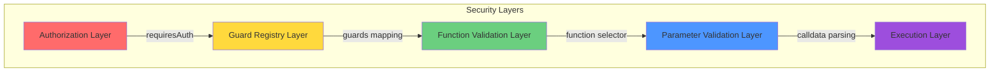
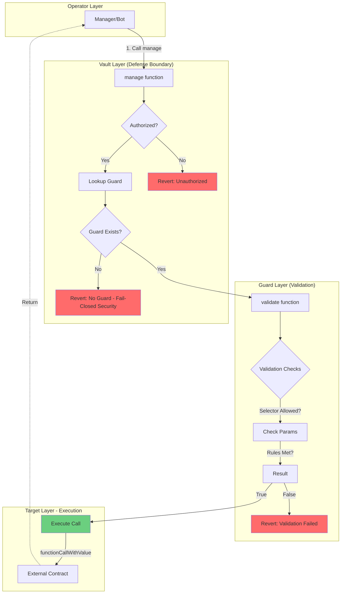
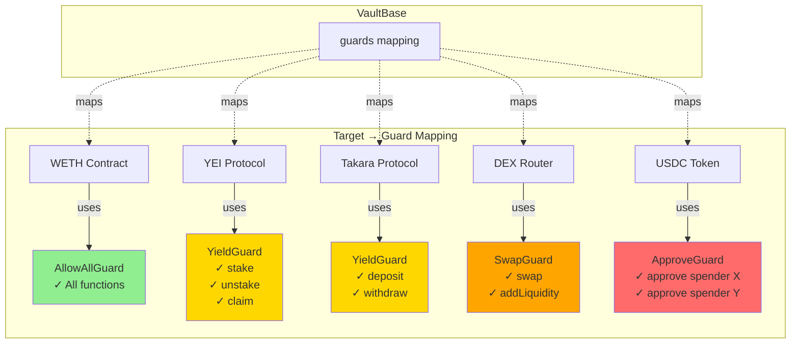
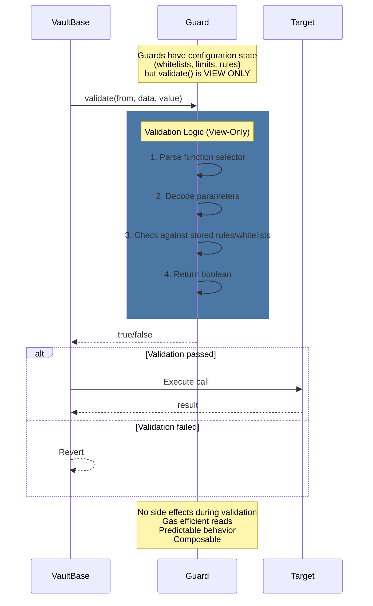
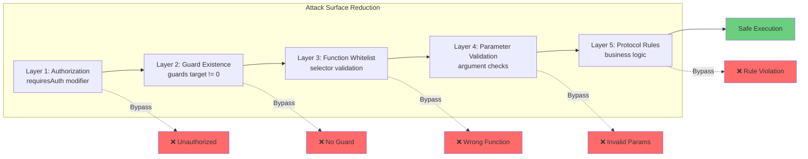
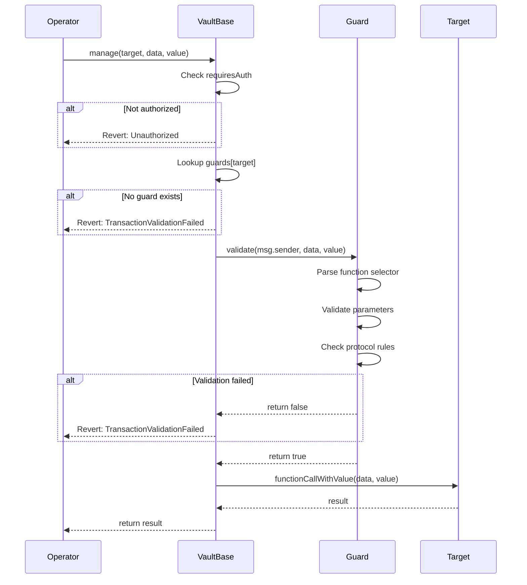

# Vault Management Security Architecture

## Overview

The `manage()` function in VaultBase provides a controlled mechanism for authorized operators to execute vault strategy
operations. This document details how the **target-based guard system** ensures security by validating all function
calls against protocol-specific rules.

**Note**: The `manageBatch()` function uses the same security model as `manage()`, applying guard validation to each
call in the batch. The principles and guarantees described here apply to both functions.

## Core Concepts

### The Manage Function

VaultBase exposes the `manage()` function for executing vault operations:

```solidity
function manage(address target, bytes calldata data, uint256 value)
    external
    requiresAuth
    returns (bytes memory result)
```

**Parameters**:

- `target` - The target contract address to call
- `data` - Function calldata (selector + encoded arguments)
- `value` - Amount of ETH to send with the call

### Purpose

This function allows authorized operators (managers, bots, multisigs) to:

- Interact with DeFi protocols (stake, unstake, claim rewards)
- Execute token swaps and rebalancing
- Manage liquidity positions
- Perform any vault strategy operation

Without proper guardrails, these functions would be extremely dangerous as they grant arbitrary external call
capabilities.

---

## Security Model

### Core Security Principles



### Principle 1: Defense at the Boundary & Mandatory Guards

Elitra employs a **guard-per-target architecture** that enforces a strict **fail-closed security model**. Rather than
trusting operators or implementing complex allowlists at the vault level, every target contract must have an explicitly
assigned guard.

This approach ensures:

1. **Fail-Closed Security**: If no guard exists for a target, the transaction reverts immediately. There is no "default
   allow" behavior.
2. **Defense in Depth**: Even authorized operators cannot interact with arbitrary contracts or call unauthorized
   functions.
3. **Component-Based Validation**: Validation logic is offloaded to stateless guard contracts, keeping the vault core
   simple and secure.



### Principle 2: Guard-per-Target Architecture



### Principle 3: View-Only Validation with Configuration State

Guards maintain **configuration state** (whitelists, limits, rules) but perform **view-only validation** - they never
modify state during the validation process.



**Key Properties**:

- **Guards have state**: Whitelists, limits, configuration parameters stored in guard contract
- **validate() is view/pure**: The validation function never writes state, only reads
- **Configuration updates**: Guards may have admin functions to update their configuration (separate from validation)

**Example State in Guards**:

- `ApproveGuard`: `mapping(address => bool) whitelistedSpenders`
- `YieldProtocolGuard`: `uint256 maxStakeAmount`, `uint256 minUnstakeAmount`
- `AllowAllGuard`: No state (pure validation)

### Security Property: Defense in Depth



---

## Guard System Architecture

### Guard Mapping

```solidity
/// @notice Mapping of target contracts to their guards
mapping(address target => ITransactionGuard guard) public guards;
```

Each target address (protocol contract) is associated with exactly one guard contract.

### Guard Interface

```solidity
interface ITransactionGuard {
    /// @notice Checks if a transaction is safe to execute
    /// @param from The caller (e.g., Manager/Bot)
    /// @param data The calldata being sent to the target
    /// @param value The ETH value being sent
    /// @return safe True if the transaction is safe, false otherwise
    function validate(
        address from,
        bytes calldata data,
        uint256 value
    ) external view returns (bool safe);
}
```

### Guard Management

Only authorized roles can configure guards:

```solidity
/// @notice Sets the guard for a specific target
/// @param target The target contract address
/// @param guard The guard contract address
function setGuard(address target, address guard)
    external
    requiresAuth
{
    guards[target] = ITransactionGuard(guard);
    emit GuardUpdated(target, guard);
}

/// @notice Removes the guard for a specific target
/// @param target The target contract address
function removeGuard(address target)
    external
    requiresAuth
{
    delete guards[target];
    emit GuardRemoved(target);
}
```

**Important**: Removing a guard effectively blacklists that target, as manage() calls will revert without a guard.

---

## Execution Flow

### Complete Execution Flow



**Note on manageBatch()**: The `manageBatch()` function applies this same validation flow to each call in sequence. All
calls must pass guard validation before any are executed.

---

## Guard Implementation Examples

### 1. AllowAllGuard (Trusted Targets)

For highly trusted contracts where parameter validation is unnecessary (e.g., WETH wrapper):

```solidity
contract AllowAllGuard is ITransactionGuard {
    function validate(address, bytes calldata, uint256)
        external
        pure
        returns (bool)
    {
        return true;
    }
}
```

**Use Cases**:

- Native token wrappers (WETH/WSEI)
- Vault's own SubVaults
- Other owned contracts

**Warning**: Only use for contracts you fully control or trust completely.

### 2. ApproveGuard (Parameter Validation)

Validates not just function selectors, but also parameters:

```solidity
contract ApproveGuard is ITransactionGuard {
    bytes4 public constant APPROVE_SELECTOR = 0x095ea7b3;  // approve(address,uint256)

    mapping(address spender => bool isAllowed) public whitelistedSpenders;

    constructor(address[] memory _spenders) {
        for (uint256 i = 0; i < _spenders.length; ++i) {
            whitelistedSpenders[_spenders[i]] = true;
        }
    }

    function validate(address, bytes calldata data, uint256)
        external
        view
        returns (bool)
    {
        if (bytes4(data) != APPROVE_SELECTOR) return false;

        // Decode spender parameter (data[4:36])
        address spender = abi.decode(data[4:36], (address));

        return whitelistedSpenders[spender];
    }
}
```

**Use Cases**:

- ERC20 token approvals
- Restricting approvals to specific DEX routers
- Limiting which contracts can spend vault tokens

**Security**: Prevents approval to malicious or untrusted addresses.

### 3. Advanced Guard (Complex Protocol Logic)

For complex protocols, guards can enforce sophisticated rules:

```solidity
contract YieldProtocolGuard is ITransactionGuard {
    bytes4 constant STAKE_SELECTOR = 0xa694fc3a;      // stake(uint256)
    bytes4 constant UNSTAKE_SELECTOR = 0x2e1a7d4d;    // unstake(uint256)
    bytes4 constant CLAIM_SELECTOR = 0x4e71d92d;      // claim()

    uint256 public maxStakeAmount;
    uint256 public minUnstakeAmount;

    function validate(address, bytes calldata data, uint256 value)
        external
        view
        returns (bool)
    {
        bytes4 sig = bytes4(data);

        // Validate stake operations
        if (sig == STAKE_SELECTOR) {
            require(value == 0, "Stake should not send ETH");
            uint256 amount = abi.decode(data[4:], (uint256));
            return amount <= maxStakeAmount;
        }

        // Validate unstake operations
        if (sig == UNSTAKE_SELECTOR) {
            uint256 amount = abi.decode(data[4:], (uint256));
            return amount >= minUnstakeAmount;
        }

        // Validate claim (no parameters)
        if (sig == CLAIM_SELECTOR) {
            return data.length == 4;  // Only selector, no params
        }

        return false;
    }
}
```

**Features**:

- Amount limits (min/max)
- ETH value validation
- Parameter structure validation
- Multi-function support

---

## Security Guarantees

### What Guards Protect Against

1. **Unauthorized Target Access**
   - Guards must be explicitly set for each target
   - No "catch-all" or default guard behavior
   - Removing a guard blacklists the target

2. **Function-Level Access Control**
   - Each guard specifies allowed function selectors
   - Prevents calling admin/governance functions
   - Blocks dangerous operations (selfDestruct, delegateCall, etc.)

3. **Parameter Validation**
   - Guards can parse and validate function arguments
   - Enforce limits (amounts, addresses, etc.)
   - Check parameter types and structure

4. **Protocol-Specific Rules**
   - Each protocol gets tailored validation logic
   - Complex rules (allocation limits, time locks, etc.)
   - Can integrate with external state if needed

### Attack Scenarios Prevented

| Attack Vector               | Prevention Mechanism                                      |
| --------------------------- | --------------------------------------------------------- |
| Call to malicious contract  | No guard registered → Call reverts                        |
| Call to dangerous function  | Guard checks selector → Returns false                     |
| Excessive approval          | ApproveGuard validates spender → Rejects unauthorized     |
| Parameter injection         | Guard parses and validates params → Rejects invalid       |
| Reentrancy via manage()     | Guards are view/pure → No state changes during validation |
| Front-running guard changes | Guard updates emit events → Transparency & monitoring     |

### Trust Assumptions

1. **Guard Correctness**: Guards must be correctly implemented. A buggy guard can allow invalid calls.
2. **Guard Immutability**: Guards themselves should be non-upgradeable or carefully governed.
3. **Role Security**: Only trusted roles can set/remove guards (governance multisig).
4. **Target Behavior**: Guards validate calls, but cannot prevent vulnerabilities in target contracts.

---

**Monitoring**: Track these events to:

- Audit all vault management activities
- Detect unusual patterns (frequency, targets, amounts)
- Build operation analytics and dashboards
- Alert on suspicious guard validation patterns

---

## Comparison with Alternative Approaches

### vs. Global Function Whitelist (previous approach)

| Feature            | Guard-per-Target                  | Global Whitelist                         |
| :----------------- | :-------------------------------- | :--------------------------------------- |
| **Protocol Rules** | ✅ Protocol-specific rules        | ❌ Can't enforce protocol-specific rules |
| **Validation**     | ✅ Granular parameter validation  | ❌ All-or-nothing per function           |
| **Auditing**       | ✅ Easier to audit per protocol   | ❌ Harder to audit complex interactions  |
| **Deployment**     | ❌ More guard contracts to deploy | ✅ Single configuration point            |

---

## Future Enhancements

### Potential Improvements

1. **Guard Registry**: Central registry for approved guard implementations
2. **Guard Versioning**: Support multiple guard versions per target
3. **Time-Locked Updates**: Delay guard changes to allow monitoring
4. **Emergency Override**: Guardian role to bypass guards in emergencies
5. **Guard Composition**: Combine multiple guards with AND/OR logic
6. **Gas Limit Guards**: Enforce gas limits per operation
7. **Rate Limiting**: Time-based restrictions on manage() calls
8. **Value Tracking**: Track total value moved per target per period

### Integration with Other Guardrails

The guard system works in conjunction with other vault protections:

- **TVL Caps**: Enforced in deposit/withdraw functions
- **Allocation Limits**: Enforced in rebalancing logic (future)
- **Slippage Protection**: Can be integrated into DEX guards
- **Loss Tolerance**: Can be checked in guards or post-execution hooks
