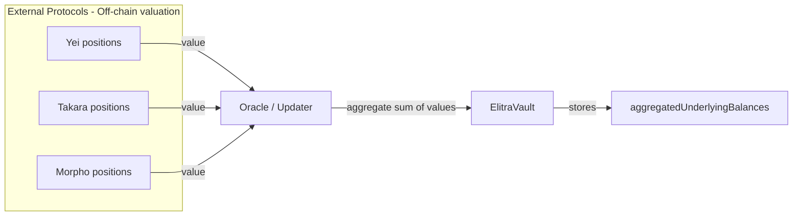

# Oracle / Balance Update Spec

This document describes how Elitra tracks external strategy balances and updates price-per-share (PPS).

## Components

- `ElitraVault` (core): stores aggregated external balances, cached PPS, and freshness state.
- `IBalanceUpdateHook`: hook interface used to validate updates and compute new PPS.
- `ManualBalanceUpdateHook`: current hook implementation with a max-percentage change threshold.

Relevant contracts:

- `src/ElitraVault.sol`
- `src/interfaces/IBalanceUpdateHook.sol`
- `src/hooks/ManualBalanceUpdateHook.sol`

## Key State

- `aggregatedUnderlyingBalances`: aggregate external balance reported by the updater.
- `lastPricePerShare`: cached PPS after the last accepted update.
- `lastBlockUpdated`: block guard to prevent multiple updates in the same block.
- `lastTimestampUpdated`: timestamp used for NAV freshness checks.
- `navFreshnessThreshold`: max allowed age (seconds) for NAV; `0` disables.

## Roles

- **Oracle / Updater**: authorized to call `updateBalance`.
- **Admin**: can set `balanceUpdateHook` and `navFreshnessThreshold`.

All of the above are `requiresAuth` calls in `ElitraVault`.

## Update Flow (On-Chain)

1. Authorized updater calls `updateBalance(newAggregatedBalance)`.
2. Vault enforces `block.number > lastBlockUpdated` to prevent same-block repeats.
3. Vault calls the hook:
   - `beforeBalanceUpdate(lastPricePerShare, totalSupply, netTotalAssets)`
   - Hook returns `(shouldContinue, newPPS)`.
4. If `shouldContinue == false`, the vault **pauses** and emits `VaultPausedDueToThreshold`.
5. If `shouldContinue == true`, the vault:
   - updates `aggregatedUnderlyingBalances`
   - updates `lastPricePerShare`
   - emits `UnderlyingBalanceUpdated` and `PPSUpdated`
   - updates `lastBlockUpdated` and `lastTimestampUpdated`

## Net Asset Calculation

The hook receives the **net** total assets:

```
netTotalAssets = idleAssets + aggregatedExternalBalances - totalPendingAssets - pendingFees
```

This ensures PPS reflects liabilities from queued redemptions and pending asset fees.

## What is `aggregatedUnderlyingBalances`?

`aggregatedUnderlyingBalances` is the vault’s on-chain snapshot of **total assets held in external strategies**.
Because the vault only directly holds idle assets, it relies on an authorized updater to report the aggregate value of
positions across off-chain strategy systems and external protocols.

Key points:

- It is an **aggregate** number (one value), not per-strategy or per-protocol balances.
- It is **trusted input** from the updater, validated only by the balance update hook (e.g., max PPS change).
- It is combined with **idle assets** held by the vault to compute total NAV and PPS.
- It is updated both by `updateBalance()` (oracle-driven) and by `manageBatchWithDelta()` (operator-driven delta).

### Visualization (Example: Yei, Takara, Morpho)



## ManualBalanceUpdateHook

Current implementation enforces a **maximum PPS change** per update.

- Default max change: `1%` (configurable).
- Maximum allowed threshold: `10%`.
- If the PPS change exceeds the threshold, the hook returns `shouldContinue = false`,
  which causes the vault to pause.

## NAV Freshness

The vault can require a recent NAV before allowing user operations:

- `navFreshnessThreshold > 0` enables the check.
- `_requireFreshNav()` reverts if `block.timestamp` is too old.
- Used to gate user flows like `deposit`/`mint` (see `ElitraVault` overrides).

## Strategy Updates via manageBatchWithDelta

`manageBatchWithDelta` applies an explicit external balance delta and then calls
the same balance update flow as the oracle path (`_updateBalance`).

This keeps PPS updates consistent for both oracle-driven and operator-driven changes.
