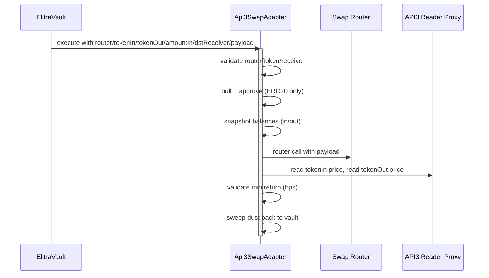

# Swap Adapter (API3)

This document explains the swap adapter used for vault-managed swaps with API3 price validation, to validate the min return of the swap, on a dependent price source rather than the swap router (API3).

## Overview

`Api3SwapAdapter` is a vault-facing adapter that can call arbitrary routers while enforcing:

- **Caller restriction**: only the configured vault can call `execute`.
- **Router whitelist** (optional): only approved routers can be used.
- **Token whitelist** (optional): only approved tokens can be swapped.
- **Min return validation**: output must be within a configurable bps threshold of the API3-implied price.
- **Stale price checks**: API3 answers must be recent or explicitly allowed by config.

The adapter uses **balance deltas** (before/after) to determine `spentIn` and `receivedOut`, then validates
`receivedOut` against API3 prices. Any leftover tokens in the adapter are swept back to the vault.

This adapter is used when the vault (or a vault-approved operator flow) needs to **swap assets** as part of a
strategy or zap path, and the vault wants to enforce price sanity and routing constraints.

## Components

- `src/adapters/Api3SwapAdapter.sol`: swap adapter with API3 validation.

## Configuration (Admin)

### Vault binding
- `vault`: the only address allowed to call `execute`.

### Whitelists
- `enforceRouterWhitelist` + `whitelistedRouters`
  - If `true`, `execute` reverts unless `router` is whitelisted.
- `enforceTokenWhitelist` + `whitelistedTokens`
  - If `true`, `execute` reverts unless both `tokenIn` and `tokenOut` are whitelisted.

### Min return (bps)
- `minReturnBps` (default `9900` = 99%).
  - If `0`, min return validation is disabled.
  - If `> 10_000`, `setMinReturnBps` reverts.

### Price feeds
Per-token config:
```
PriceFeedConfig {
  proxy: API3 reader proxy
  decimals: feed decimals
  staleSeconds: per-token stale threshold (0 = use default)
}
```
Global default:
- `defaultStaleSeconds` (default `1 hour`).

## Execution Flow (`execute`)

1. **Vault triggers a swap**
   - The vault (only caller allowed) invokes `execute` on the adapter as part of a strategy or zap flow.
   - The payload includes the router call data and the intended swap parameters.

2. **Validate inputs**
   - Router allowlist (if enforced).
   - Token allowlist (if enforced).
   - `dstReceiver` must be `address(0)`, the adapter itself, or the vault.

3. **Determine receiver**
   - If `dstReceiver == address(0)`, receiver is the adapter.

4. **Pull and approve**
   - If `tokenIn` is ERC20:
     - Pull `amountIn` from vault if adapter balance is insufficient.
     - Approve router for `amountIn`.
   - If `tokenIn` is native: no pull/approve; router uses `msg.value`.

5. **Snapshot balances**
   - `srcBalanceBefore` for `tokenIn` at adapter.
   - `dstBalanceBefore` for `tokenOut` at `receiver`.

6. **Router call**
   - `router.call(payload)` (with `msg.value`).
   - Revert if call fails.
   - Reset approval back to `0` (ERC20 only).

7. **Compute deltas**
   - `spentIn = max(srcBalanceBefore - srcBalanceAfter, 0)`
   - `receivedOut = max(dstBalanceAfter - dstBalanceBefore, 0)`

8. **Validate min return (if enabled)**
   - Compare the received output against API3-implied value.
   - Revert if the output is below the configured `minReturnBps` threshold.

9. **Sweep**
   - Any remaining `tokenIn` or `tokenOut` in the adapter is swept back to the vault.

## Mermaid Flow



## When the Vault Uses the Adapter

Typical use cases:
- **Strategy execution**: the vault needs to swap assets to enter/exit external protocols.
- **Zap flows**: cross-chain or local zap paths require a swap before depositing into the vault.

Operationally:
- A strategy call in `manageBatchWithDelta` (or a zap path) includes the adapter call.
- The adapter enforces safety checks (whitelists + min return).
- Output ends up at the vault (directly or via sweep).

## Zap vs Swap

- **ZapExecutor**: used for cross-chain deposits; runs arbitrary calls without price checks (`src/crosschain-adapters/ZapExecutor.sol`).
- **Api3SwapAdapter**: used when the vault needs a swap with API3-based validation (`src/adapters/Api3SwapAdapter.sol`).

## Price Feed Validation

When reading `IApi3ReaderProxy.read()`:
- `value` must be positive.
- `updatedAt` must not be in the future.
- `updatedAt` must not be older than `staleSeconds` (token-specific or default).

Price is scaled to 18 decimals:
```
if feedDecimals < 18: price * 10^(18 - feedDecimals)
if feedDecimals > 18: price / 10^(feedDecimals - 18)
```

## Receiver Restrictions

`dstReceiver` is constrained to:
- `address(0)` (adapter)
- `address(this)` (adapter)
- `vault`

This prevents routers from sending output to arbitrary addresses. If the adapter is the receiver, `_sweep`
forwards all output to the vault.
